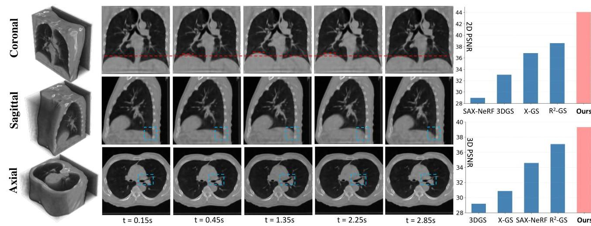
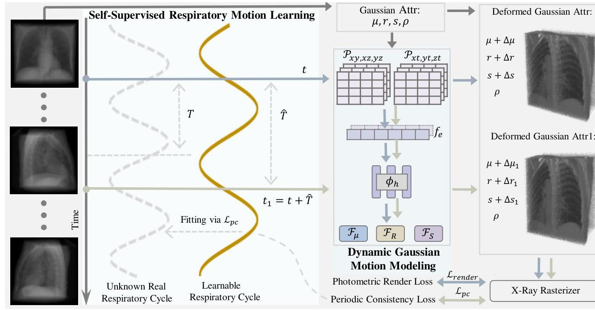
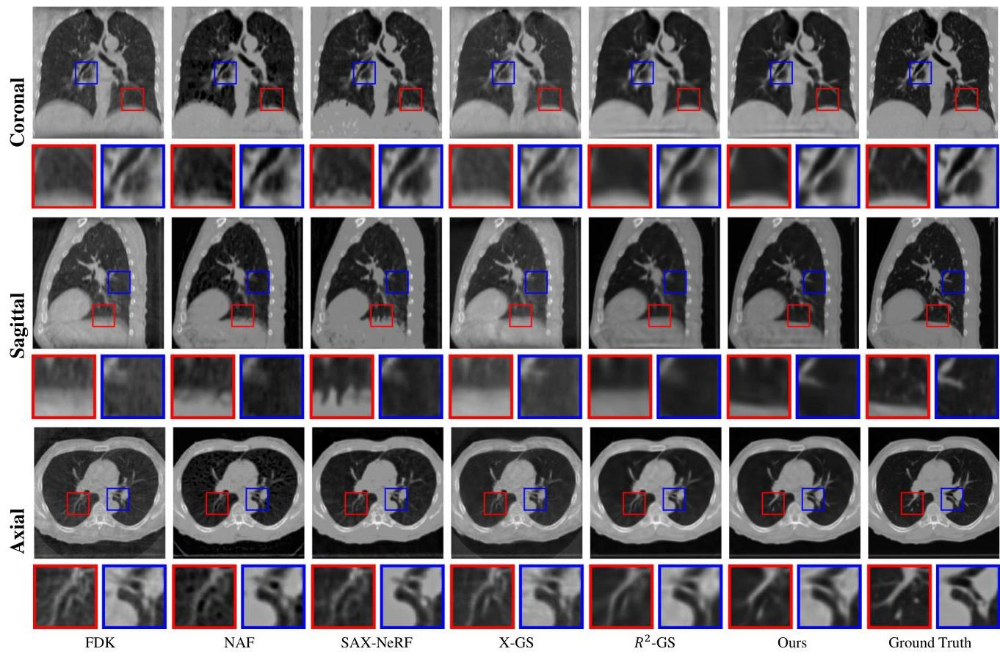
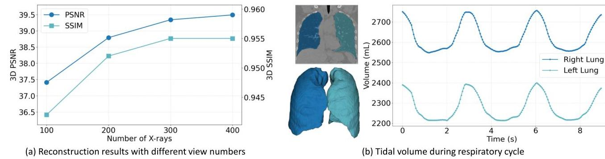

# $\mathrm{X}^{2}$-Gaussian: 4D Radiative Gaussian Splatting for Continuous-time Tomographic Reconstruction 

Weihao Yu ${ }^{1}$ Yuanhao Cai ${ }^{2}$ Ruyi Zha ${ }^{3}$ Zhiwen Fan ${ }^{4}$ Chenxin $\mathrm{Li}^{1}$ Yixuan Yuan ${ }^{1 *}$ ${ }^{1}$ The Chinese University of Hong Kong ${ }^{2}$ Johns Hopkins University ${ }^{3}$ The Australian National University ${ }^{4}$ University of Texas at Austin

Figure 1. Dynamic reconstruction results of the proposed $\mathrm{X}^{2}$-Gaussian on public DIR Dataset [9]. The red dashed line is the reference line for diaphragm movement, and blue dashed box shows some tissue deformation. Our method demonstrates superior capability in continuous-time reconstruction, significantly outperforming existing approaches.

## Abstract

Four-dimensional computed tomography (4D CT) reconstruction is crucial for capturing dynamic anatomical changes but faces inherent limitations from conventional phase-binning workflows. Current methods discretize temporal resolution into fixed phases with respiratory gating devices, introducing motion misalignment and restricting clinical practicality. In this paper, We propose $X^{2}$ Gaussian, a novel framework that enables continuoustime 4D-CT reconstruction by integrating dynamic radiative Gaussian splatting with self-supervised respiratory motion learning. Our approach models anatomical dynamics through a spatiotemporal encoder-decoder architecture that predicts time-varying Gaussian deformations, eliminating phase discretization. To remove dependency on external gating devices, we introduce a physiology-driven periodic consistency loss that learns patient-specific breathing cycles directly from projections via differentiable opti-

[^0]mization. Extensive experiments demonstrate state-of-theart performance, achieving a 9.93 dB PSNR gain over traditional methods and 2.25 dB improvement against prior Gaussian splatting techniques. By unifying continuous motion modeling with hardware-free period learning, $X^{2}$ Gaussian advances high-fidelity 4D CT reconstruction for dynamic clinical imaging. Code is publicly available at: https://x2-gaussian.github.io/.

## 1. Introduction

Four-dimensional computed tomography (4D CT) has become a cornerstone in dynamic medical imaging[24, 25, 55, 56], especially for respiratory motion management in clinical applications such as image-guided radiotherapy (IGRT) [12, 38]. By capturing both spatial and temporal information of the chest cavity during breathing cycles, 4D CT enables clinicians to monitor and assess respiratory-induced tumor motion and other dynamic anatomical changes during treatment $[3,13,49]$.

[^0]:    *Corresponding Author.

---

Traditional 4D CT reconstruction follows a phasebinning workflow. It first divides the projections into discrete respiratory phases using external gating devices that require direct patient contact, followed by independent reconstruction of each phase to obtain a sequence of 3D volumes. Within this framework, 3D reconstruction methods such as Feldkamp-David-Kress (FDK) algorithm [42], or total variation minimization [47, 48], can be directly applied to 4D CT reconstruction. Due to the limited number of projections available per phase, the reconstructed CT images frequently exhibit significant streak artifacts, which degrade the visibility of fine tissue structures. To address this issue, several researchers [5, 11, 33, 41, 70] have proposed methods for extracting patient-specific motion patterns to compensate for respiratory motion across different phases. Meanwhile, other studies [22, 24, 25, 31, 71] have explored the use of Convolutional Neural Networks (CNNs) to restore details in artifact-contaminated images.

Recent advances in Neural Radiance Fields (NeRF) [37] have introduced improved methods for CT reconstruction [7, 67]. These approaches enable high-fidelity 3D reconstruction from sparse views, thereby mitigating the projection undersampling issues caused by phase partitioning. The emergence of 3D Gaussian splatting (3DGS) [29] has further facilitated the development of more efficient and higher-quality methods [6, 68]. Despite these progress, the reconstruction of 4D CT still suffers from two challenges rooted in the traditional phase-binning paradigm. Firstly, previous methods simulate 4D imaging through a series of disjoint 3D reconstructions at predefined phases, failing to model the continuous spatiotemporal evolution of anatomy. This discretization introduces temporal inconsistencies, limits resolution to a few static snapshots per cycle, and produces artifacts when interpolating between phases. Secondly, they heavily relies on external respiratory gating devices, not only introducing additional hardware dependencies and potential measurement errors that can compromise reconstruction accuracy, but also imposing physical constraints and discomfort on patients during the scanning process.

To overcome these limitations, we propose $\mathrm{X}^{2}$-Gaussian, a novel framework that achieves genuine 4D CT reconstruction by directly modeling continuous anatomical motion. Firstly, unlike previous approaches that perform sequential 3D reconstructions, our method introduces a dynamic Gaussian motion model that explicitly captures the continuous deformation of anatomical structures over time by extending radiative Gaussian splatting [68] into the temporal domain. Specifically, we design a spatiotemporal encoder that projects Gaussian properties onto multi-resolution feature planes, effectively capturing both local anatomical relationships and global motion patterns. The encoded features are then processed by a lightweight multi-head decoder network that predicts deformation parameters for each Gaussian at any queried timestamp, enabling true 4D reconstruc-
tion without discrete phase binning. Secondly, we introduce a self-supervised respiratory motion learning method to eliminate the requirement of external gating devices. By leveraging the quasi-periodic nature of respiratory motion, our approach learns to estimate the breathing period directly from the projection data through a novel physiology-driven periodic consistency mechanism that enforces temporal coherence across respiratory cycles. This approach fundamentally differs from traditional phase-based methods by transforming the discrete phase assignments into learnable continuous parameters, enabling our model to automatically discover and adapt to patient-specific breathing patterns.

As shown in Fig. 1, $\mathrm{X}^{2}$-Gaussian exhibits superior reconstruction performance compared to existing state-of-the-art methods, establishing a new benchmark in 4D CT reconstruction. Our contributions can be summarized as follows:

- We present $\mathrm{X}^{2}$-Gaussian, the first method to directly reconstruct time-continuous 4D-CT volumes from projections, which bypasses phase binning entirely, enabling motion analysis at arbitrary temporal resolutions.
- We extend the static radiative Gaussian splatting into the temporal domain. To our knowledge, this is the first attempt to explore the potential of Gaussian splatting in dynamic tomographic reconstruction.
- We introduce a novel self-supervised respiratory motion learning module that jointly estimates the respiratory cycle and enforces periodic consistency, eliminating reliance on external gating devices.
- Extensive experiments demonstrate that our method significantly improves reconstruction quality, reduces streak artifacts, and accurately models respiratory motion, while also showing potential for automatic extraction of various clinical parameters.

## 2. Related Work

### 2.1. CT Reconstruction

Traditional 3D computed tomography reconstruction methods mainly include two categories: analytical algorithms [15, 57] and iterative algorithms [1, 35, 44, 46]. Analytical methods estimate the radiodensity by solving Radon transformation and its inverse version. Iterative algorithms are based on optimization over iterations. In recent years, deep learning based models [2, 18, 26, 32, 34, 63] like CNNs have been employed to learn a brute-force mapping from X-ray projections to CT slices. With the development of 3D deep learning techniques $[29,36,37,53,58-62,65]$, another technical route is to employ the 3D rendering algorithms such as neural radiance fields (NeRF) [37] and 3D Gaussian Splatting (3DGS) [29] to solve the CT reconstruction prolblem in a self-supervised manner, i.e. using only 2D X-rays for training. Based on these algorithms, when coping with 4D CTs, researchers typically segment the projections into ten discrete respiratory phases for sequential 3D reconstruction. This approach not only necessitates ex-

---

Figure 2. Framework of our X2-Gaussian, which consists of two innovative components: (1) Dynamic Gaussian motion modeling for continuous-time reconstruction; (2) Self-Supervised respiratory motion learning for estimating breathing cycle autonomously.

ternal devices for phase measurement during scanning but also impedes accurate modeling of the continuous motion of anatomical structures. Concurrent work [17] also employs dynamic Gaussian splatting. However, they merely establish ten timestamps corresponding to ten phases, thereby maintaining a discrete representation. In contrast, this paper is dedicated to achieving truly continuous-time 4D CT reconstruction.

### 2.2. Gaussian Splatting

3D Gaussian splatting [29] (3DGS) is firstly proposed for view synthesis. It uses millions of 3D Gaussian point clouds to represent scenes or objects. In the past two years, 3DGS has achieved great progress in scene modeling [51, 54, 64, 69], SLAM [36, 53, 65], 3D Generation [40, 52], medical imaging [6, 68], etc. For instance, Cai et al. design the first 3DGS-based method, X-GS [6], for X-ray projection rendering. Later work R2GS [68] rectifies 3DGS pipeline to enable the direct CT reconstruction. Nonetheless, these algorithms show limitations in reconstructing dynamic CT volumes. Our goal is to cope with this problem.

### 3. Preliminaries

Radiative Gaussian Splatting [68] represents 3D CT using a collection of Gaussian kernels $\mathbb{G} = \{G_i\}_{i=1}^{K}$, each characterized by its central position $\mu_i \in \mathbb{R}^3$, covariance matrix $\Sigma_i \in \mathbb{R}^{3 \times 3}$, and isotropic density $\rho_i$:

$$G_i(\mathbf{x}|\rho_i, \mu_i, \Sigma_i) = \rho_i \cdot \exp\left(-\frac{1}{2}(\mathbf{x} - \mu_i)^T \Sigma_i^{-1}(\mathbf{x} - \mu_i)\right). \tag{1}$$

The covariance matrix can be decomposed as: $\Sigma_i = \mathbf{R}_i \mathbf{S}_i \mathbf{S}_i^T \mathbf{R}_i^T$, where $\mathbf{R}_i \in \mathbb{R}^{3 \times 3}$ is the rotation matrix and $\mathbf{S}_i \in \mathbb{R}^{3 \times 3}$ is the scaling matrix. Then the total density at position $\mathbf{x}$ is computed as the sum of all contributed Gaussian kernels:

$$\sigma(\mathbf{x}) = \sum_{i=1}^{N} G_i(x|\rho_i, \mu_i, \Sigma_i). \tag{2}$$

For 2D image rendering, the attenuation of X-ray through a medium follows the Beer-Lambert Law [27]:

$$I(\mathbf{r}) = \log I_0 - \log I'(\mathbf{r}) = \int \sigma(\mathbf{r}(t))dt,\tag{3}$$

where $I_0$ is the initial X-ray intensity, $\mathbf{r}(t) = \mathbf{o} + t \mathbf{d} \in \mathbb{R}^3$ represents a ray path, and $\sigma(\mathbf{x})$ denotes the isotropic density at position $\mathbf{x} \in \mathbb{R}^3$. Thus, the final pixel value is obtained by integrating the density field along each ray path

$$I_r(\mathbf{r}) = \sum_{i=1}^{N} \int G_i(\mathbf{r}(t)|\rho_i, \mu_i, \Sigma_i)dt,\tag{4}$$

where $I_r(\mathbf{r})$ is the rendered pixel value.

---

## 4. Methods

### 4.1. Overview

Given a sequence of X-ray projections $\{I_{j}\}_{j=1}^{N}$ acquired at timestamps $\{t_{j}\}_{j=1}^{N}$ and view matrices $\{\boldsymbol{M}_{j}\}_{j=1}^{N}$, our goal is to learn a continuous representation of the dynamic CT volume that can be queried at arbitrary timestamps, thereby overcoming the inherent limitations of discrete phase binning. To accomplish this, as shown in Fig. 2, our method seamlessly integrates dynamic Gaussian motion modeling with a self-supervised respiratory motion learning scheme into a unified, end-to-end differentiable framework. Specifically, raw Gaussian parameters are initialized from $\{I_{j}\}_{j=1}^{N}$ and $\{\boldsymbol{M}_{j}\}_{j=1}^{N}$. Given a timestamp $t_{j}$, dynamic Gaussian motion modeling module predicts the deformation of each parameter, allowing continuous-time reconstruction. Additionally, we model the respiratory cycle as a learnable parameter and sample another timestamp accordingly. Through carefully designed periodic consistency loss, we mine the real breathing period in a self-supervised way.

### 4.2. Dynamic Gaussian Motion Modeling

To achieve continuous 4D CT reconstruction, we introduce a deformation field that models the anatomical dynamics. At the core of our method is a time-dependent deformation field $\mathcal{D}(\boldsymbol{\mu}_{i},t)$ that predicts the deformation parameters $\Delta G_{i}$ for each Gaussian at time $t$. The deformed Gaussians $G_{i}^{{}^{\prime}}$ can be computed as:

$G_{i}^{{}^{\prime}}=G_{i}+\Delta G_{i}=\left(\boldsymbol{\mu}_{i}+\Delta\boldsymbol{\mu}_{i},\boldsymbol{R}_{i}+\Delta\boldsymbol{R}_{i},\boldsymbol{S}_{i}+\Delta\boldsymbol{S}_{i},\rho_{i}\right),$ (5)

where $\Delta\boldsymbol{\mu}_{i}$, $\Delta\boldsymbol{R}_{i}$, and $\Delta\boldsymbol{S}_{i}$ are the deformation offsets for position, rotation, and scaling, respectively. Our deformation field $\mathcal{D}$ is implemented as a composition of two components: $\mathcal{D}=\mathcal{F} \circ \mathcal{E}$, where $\mathcal{E}$ is a spatiotemporal encoder and $\mathcal{F}$ is a deformation-aware decoder.

Decomposed Spatio-Temporal Encoding. To encode the spatiotemporal features of Gaussian primitives, a straightforward approach would be to employ neural networks to directly parameterize $\mathcal{E}$. But such a method may lead to low rendering speed and potential overfitting issues, especially given the sparse projection data in 4D CT reconstruction. Inspired by recent advances in dynamic scene reconstruction [8, 14, 51], we adopt a decomposed approach that factorizes the 4D feature space into a set of multi-resolution K-Planes [16], which reduces memory requirements while preserving the ability to model complex spatiotemporal patterns in respiratory motion.

Specifically, given a Gaussian center $\boldsymbol{\mu}=(x, y, z)$ and timestamp $t$, we project 4D coordinates $\boldsymbol{v}=(x, y, z, t)$ onto six orthogonal feature planes: three spatial planes $\mathcal{P} x y$, $\mathcal{P} x z, \mathcal{P} y z$ and three temporal planes $\mathcal{P} x t, \mathcal{P} y t, \mathcal{P} z t$. Each plane $\mathcal{P} \in \mathbb{R}^{d \times l M \times l M}$ stores learnable features of dimension $d$ at multiple resolutions $l \in 1, \ldots, L$, where $M$ is the

Figure 3. Periodic display of respiratory motion $(T=3 s)$. A specific anatomical structure (framed by boxes of the same color) at time $t$ has the same position at time $t+n T$.
basic resolution, enabling simultaneous modeling of fine local motion and global respiratory patterns. The encoded feature $\boldsymbol{f}_{e}$ is computed through bilinear interpolation across multi-resolution planes:

$$
f_{e}=\oplus_{l} \otimes_{(a, b)} \psi\left(\mathcal{P}_{a b}^{l}(\boldsymbol{v})\right)
$$

where $\psi$ denotes bilinear interpolation, $\oplus$ represents feature concatenation, $\otimes$ is Hadamard product, and $(a, b) \in$ $\{(x, y),(x, z),(y, z),(x, t),(y, t),(z, t)\}$. Then $\boldsymbol{f}_{e}$ is further merged through a tiny feature fusion network $\phi_{h}$ (i.e. one layer of MLP) as $\boldsymbol{f}_{h}=\phi_{h}\left(\boldsymbol{f}_{e}\right)$.

Deformation-Aware Gaussian Decoding. Once the spatiotemporal features are encoded, we employ a lightweight multi-head decoder network $\mathcal{F}$ to predict the deformation parameters for each Gaussian:

$$
\Delta \boldsymbol{\mu}, \Delta \boldsymbol{R}, \Delta \boldsymbol{S}=\mathcal{F}_{\mu}\left(\boldsymbol{f}_{h}\right), \mathcal{F}_{R}\left(\boldsymbol{f}_{h}\right), \mathcal{F}_{S}\left(\boldsymbol{f}_{h}\right)
$$

Such decoupled design allows specialized learning of different motion characteristics: position shifts for translational movements, rotation for orientation changes, and scaling for volumetric expansion/contraction. Then the deformed Gaussian parameters at timestamp $t$ can be calculated according to Eq. 5. In this way, our dynamic Gaussian motion modeling not only allows independently fine-tune different aspects of motion but also facilitates continuous interpolation across time, yielding smooth temporal transitions in the reconstructed CT volume.

### 4.3. Self-Supervised Respiratory Motion Learning

To eliminate the need for external respiratory gating devices while accurately capturing breathing patterns, we introduce a self-supervised approach that directly learns respiratory motion from projection data. Our method leverages the inherently periodic nature of human respiration to establish temporal coherence across respiratory cycles.

---

Figure 4. Convergence behavior of the learnable period $\hat{T}$. Without Bounded Cycle Shifts, $\hat{T}$ undergoes wide-ranging oscillations approaching half the true period. Without Log-Space Parameterization, the optimization curve exhibits large oscillations. With both techniques implemented, $\hat{T}$ converges stably and accurately to the correct breathing cycle.

**Physiology-Driven Periodic Consistency Loss.** Respiratory motion exhibits an inherently cyclic pattern, with anatomical structures returning to approximately the same position after each breathing cycle [20]. This physiological characteristic serves as a powerful prior to constrain the reconstruction process. As illustrated in Fig. 3, a given anatomical position at time $t$ should match its state at time $t+nT$, where $T$ represents the respiratory period and $n$ is an integer. To explicitly encode this periodicity, we enforce a consistency constraint on the rendered images:

$$I(t) = I(t+nT).\tag{8}$$

In practice, we define a periodic consistency loss:

$$\mathcal{L}_{pc} = \mathcal{L}_1(I(t), \, I(t+nT)) + \lambda_1 \, \mathcal{L}_{ssim}(I(t), \, I(t+nT)),\tag{9}$$

which encourages the reconstructed images at times $t$ and $t+nT$ to be similar. Here, $\mathcal{L}_1$ and $\mathcal{L}_{ssim}$ are L1 loss and D-SSIM loss [50], respectively. This constraint effectively reduces the temporal degrees of freedom in our model by enforcing cyclic coherence, helping to mitigate artifacts and improve reconstruction quality, especially in regions with significant respiratory-induced motion.

**Differentiable Cycle-Length Optimization.** In realistic scenarios, the true respiratory cycle $T$ is not available a priori. Hence, we treat it as a learnable parameter $\hat{T}$ within our framework. Instead of being provided externally, $\hat{T}$ is optimized directly from the projection data by backpropagating the periodic consistency loss. This allows the network to automatically discover the breathing period in a self-supervised manner. To ensure numerical stability and avoid harmonic artifacts, we implement two critical designs:

- **Bounded Cycle Shifts:** We restrict the integer $n$ in our periodic consistency loss to $n \in \{-1, 1\}$, focusing only on adjacent respiratory cycles. This restriction is critical for avoiding potential ambiguities in period estimation. When using larger values of $n$, the optimization might converge to period estimates that are multiples or divisors of the true period. For example, if the true period $T$ is 3 seconds and our model learns $\hat{T} = 4$ seconds, then with $n = 6$, we would enforce consistency between times $t$ and $t + 24$ seconds, which coincidentally satisfies periodicity (as 24 is divisible by the true period of 3). By limiting $n$ to adjacent cycles, we ensure the model learns the fundamental period rather than its harmonics.
- **Log-Space Parameterization:** We represent $\hat{T} = \exp(\hat{\tau})$ where $\hat{\tau} \in \mathbb{R}$ is an unbounded learnable variable. This ensures positivity and provides smoother gradient updates compared to direct period estimation. This logarithmic parameterization ensures $T$ remains positive, improves numerical stability by preventing extremely small period values, and creates a more uniform gradient landscape for optimization.

As shown in Fig. 4, these two technical designs are critical for accurate and stable period estimation. Without bounded cycle shifts, the learned period $\hat{T}$ oscillates with large amplitude approaching sub-harmonics (*i.e*. $T/2$) of the true respiratory period, as the periodic consistency loss can be satisfied by most common multiples of sub-harmonics. Direct optimization in linear space leads to pronounced oscillations in the learning trajectory of $\hat{T}$. With both techniques implemented, $\hat{T}$ converges stably and accurately to the correct breathing cycle. In this way, we reformulate Eq. 9 as

$$\begin{split}
\mathcal{L}_{pc} &= \mathcal{L}_1(I(t), \, I(t+n\exp(\hat{\tau})) \\
&+ \lambda_1 \, \mathcal{L}_{ssim}(I(t), \, I(t+n\exp(\hat{\tau}))),
\end{split} \tag{10}$$

where $n \in \{-1, 1\}$. Then the optimal period $T^*$ can be learned via

$$\tau^* = \arg\min_{\tau} \mathcal{L}_{pc}, \quad T^* = \exp(\tau^*).\tag{11}$$

Through this self-supervised optimization approach, our model automatically discovers patient-specific breathing patterns directly from projection data without requiring external gating devices, simplifying clinical workflow while improving reconstruction accuracy.

### 4.4. Optimization

**Loss Function.** We optimize our framework by employing a compound loss function. Similar to $\mathcal{L}_{pc}$, we use L1 loss and D-SSIM loss to supervise the rendered X-ray projections as $\mathcal{L}_{render} = \mathcal{L}_1 + \lambda_2 \, \mathcal{L}_{ssim}$. Following [68], we integrate a 3D total variation (TV) regularization term [43] $\mathcal{L}_{TV}^{3D}$ to promote spatial homogeneity in the CT volume. We also apply a grid-based TV loss [8, 16, 51] $\mathcal{L}_{TV}^{4D}$ to the multi-resolution k-plane grids used during spatiotemporal encoding. The overall loss function is then defined

---

Table 1. Comparison of our $\mathrm{X}^{2}$-Gaussian with different methods on the DIR dataset.

| Method | Patient1 | | Patient2 | | Patient3 | | Patient4 | | Patient5 | | Average | |
| --- | --- | --- | --- | --- | --- | --- | --- | --- | --- | --- | --- | --- |
| | PSNR | SSIM | PSNR | SSIM | PSNR | SSIM | PSNR | SSIM | PSNR | SSIM | PSNR | SSIM |
| FDK [42] | 34.47 | 0.836 | 25.05 | 0.624 | 34.23 | 0.826 | 28.05 | 0.709 | 25.25 | 0.638 | 29.41 | 0.727 |
| IntraTomo [66] | 40.04 | 0.965 | 30.62 | 0.889 | 33.55 | 0.888 | 33.00 | 0.910 | 32.8 | 0.935 | 34.00 | 0.917 |
| NeRF [37] | 40.85 | 0.964 | 32.87 | 0.917 | 33.43 | 0.897 | 33.66 | 0.922 | 34.29 | 0.955 | 35.02 | 0.931 |
| TensoRF [10] | 33.21 | 0.907 | 30.32 | 0.864 | 33.47 | 0.881 | 33.64 | 0.813 | 32.40 | 0.928 | 32.61 | 0.898 |
| NAF [67] | 38.21 | 0.945 | 31.73 | 0.875 | 34.11 | 0.900 | 33.95 | 0.911 | 31.74 | 0.927 | 33.95 | 0.912 |
| SAX-NeRF [7] | 37.21 | 0.961 | 31.53 | 0.938 | 36.71 | 0.929 | 34.30 | 0.944 | 33.14 | 0.947 | 34.58 | 0.942 |
| 3D-GS [29] | 34.19 | 0.847 | 22.96 | 0.713 | 32.53 | 0.840 | 26.32 | 0.793 | 29.89 | 0.812 | 29.18 | 0.801 |
| X-GS [6] | 38.00 | 0.903 | 25.32 | 0.739 | 33.54 | 0.854 | 28.69 | 0.807 | 28.77 | 0.793 | 30.86 | 0.819 |
| R ${ }^{2}$-GS [68] | 40.51 | 0.966 | 33.75 | 0.921 | 39.66 | 0.956 | 36.45 | 0.938 | 35.09 | 0.937 | 37.09 | 0.943 |
| Ours | 44.6 | 0.978 | 35.32 | 0.935 | 43.22 | 0.972 | 37.18 | 0.942 | 36.36 | 0.947 | 39.34 | 0.955 |

Table 2. Comparison of our $\mathrm{X}^{2}$-Gaussian with different methods on the 4DLung and SPARE datasets.

| Method | 4DLung | | SPARE | |
| --- | --- | --- | --- | --- |
| | PSNR | SSIM | PSNR | SSIM |
| FDK [42] | 27.03 | 0.611 | 14.25 | 0.359 |
| IntraTomo [66] | 34.28 | 0.939 | 27.29 | 0.871 |
| TensoRF [10] | 34.55 | 0.937 | 26.91 | 0.857 |
| NAF [67] | 34.94 | 0.936 | 28.44 | 0.893 |
| X-GS [6] | 29.62 | 0.705 | 18.20 | 0.442 |
| R ${ }^{2}$-GS [68] | 37.31 | 0.952 | 31.12 | 0.908 |
| Ours | 38.61 | 0.957 | 32.24 | 0.922 |

as:

$$
\mathcal{L}_{\text {total }}=\mathcal{L}_{\text {render }}+\alpha \mathcal{L}_{p c}+\beta \mathcal{L}_{T V}^{3 D}+\gamma \mathcal{L}_{T V}^{4 D}
$$

where $\alpha, \beta$, and $\gamma$ are weights that control the relative influence of the periodic consistency and regularization terms.

Progressive Training Procedure. During training, we first train a static 3D radiative Gaussian splatting model [68] for 5000 iterations. This warm-up phase ensures that the model effectively captures the underlying anatomical structures from the projection data. After the warm-up period, we extend the framework to its full 4D form. The Gaussian parameters, spatiotemporal encoder/decoder, and the learnable respiratory period parameter $\hat{\tau}$ are jointly optimized using the combined loss $\mathcal{L}_{\text {total }}$. This progressive training strategy enables the model to build on a robust 3D reconstruction before incorporating temporal dynamics, resulting in stable convergence and high-quality dynamic reconstruction.

## 5. Experiments

### 5.1. Dataset and Implementation Details

We conducted experiments on 4D CT scans from 13 patients across three public datasets: 5 patients from DIR dataset [9], 5 from 4DLung dataset [23], and 3 from SPARE dataset [45]. Each patient's 4D CT consists of 103 D CTs from different phases. We used the tomographic toolbox TIGRE [4] to simulate clinically significant one-minute 4D CT sampling. The respiratory cycle was configured at 3 seconds, with the corresponding phase determined based on sampling time to obtain X-ray projections. For each patient, 300 projections were sampled, which is substantially fewer than the several thousand projections currently required in clinical settings.

Our $\mathrm{X}^{2}$-Gaussian was implemented by PyTorch [39] and CUDA [19] and trained with the Adam optimizer [30] for 30 K iterations on an RTX 4090 GPU. Learning rates for position, density, scale, and rotation are initially set at 2 e -$4,1 \mathrm{e}-2,5 \mathrm{e}-3$, and $1 \mathrm{e}-3$, respectively, and decay exponentially to $10 \%$ of their initial values. The initial learning rates for the spatio-temporal encoder, decoder, and learnable period are set at $2 \mathrm{e}-3,2 \mathrm{e}-4$, and $2 \mathrm{e}-4$, respectively, and similarly decay exponentially to $10 \%$ of their initial values. $\hat{\tau}$ was initialized to $1.0296(\hat{T}=2.8) . \lambda_{1}$ and $\lambda_{2}$ in $\mathcal{L}_{p c}$ and $\mathcal{L}_{\text {render }}$ were $0.25 . \alpha, \beta$, and $\gamma$ in Eq. 12 were set to $1.0,0.05$, and 0.001 , respectively. During testing, We used PSNR and SSIM to evaluate the volumetric reconstruction performance. $\mathrm{X}^{2}$-Gausian predicted 103 D CTs corresponding to the time of each phase, with PSNR calculated on the entire 3D volume and SSIM computed as the average of 2D slices in axial, coronal, and sagittal directions.

### 5.2. Results

Tab. 1 and Tab. 2 illustrate the quantitative results of our $\mathrm{X}^{2}$ Gaussian and SOTA 3D reconstruction methods which follow the phase-bining workflow, including traditional methods (FDK [42]), NeRF-based methods (IntraTomo [66], NeRF [37], TensoRF [10], NAF [67], SAX-NeRF [7]), and

---

Figure 5. Qualitative comparison of reconstruction results across coronal, sagittal, and axial planes. Our method shows superior performance in modeling dynamic regions (e.g., diaphragmatic motion and airway deformation) while preserving finer anatomical details compared to existing approaches.

GS-based methods (3D-GS [29], X-GS [6], R²-GS [68]). As can be seen in Tab. 1, our method significantly outperforms other approaches in reconstruction quality. Specifically, compared to the traditional FDK method, our approach demonstrates a 9.93 dB improvement in PSNR, achieving approximately a 34% enhancement. When compared to state-of-the-art methods, our approach surpasses the NeRF-based method SAN-NeRF by 4.76 dB and the GS-based method R2-GS by 2.25 dB. Similar results can be observed in Tab. 2, demonstrating the superiority of our method.

Fig. 5 shows the quantitative comparison of reconstruction results between our method and existing approaches. Examination of the coronal and sagittal planes shows that our method distinctly captures diaphragmatic motion with remarkable fidelity, which can be attributed to the powerful continuous-time reconstruction capability of X²-Gaussian. Similarly, on the axial plane, X²-Gaussian successfully reconstructs the deformed airways. Additionally, X²-Gaussian preserves fine anatomical details that competing approaches fail to recover, underscoring its effectiveness for high-fidelity volumetric reconstruction.

### 5.3. Ablation study

**Period Optimization** Tab. 3 demonstrates the effectiveness of our X²-Gaussian for respiratory cycle estimation and examines how various optimization techniques influence estimation precision. Our approach achieves exceptional accuracy with an average error of just 5.2 milliseconds—approximately one-thousandth of a typical human respiratory cycle. This precision stems from two key technical contributions: Log-Space Parameterization and Bounded Cycle Shifts. Without Log-Space Parameterization, we observe oscillatory convergence behavior that compromises accuracy. More dramatically, when Bounded Cycle Shifts are omitted, the optimization incorrectly converges to harmonic frequencies rather than the fundamental cycle, resulting in a 40-fold increase in estimation error. These findings highlight the critical importance of our optimization framework in achieving reliable respiratory cycle estimation.

**Component Analysis** We conducted ablation experiments on DIR dataset to validate the effect of key components in X²-Gaussian, including the dynamic gaussian.

---

Figure 6. (a) Reconstruction results of X²-Gaussian using different numbers of projections. (b) Temporal variations of lung volume in 4D CT reconstructed by X²-Gaussian.

motion modeling (DGMM) and self-supervised respiratory motion learning (SSRML). Tab. 4 reports the results. As we can see, DGMM extends the static 3D radiative Gaussian splatting model to temporal domain, enabling continuous-time reconstruction and achieving improved 4D reconstruction results. Building upon this foundation, SSRML leverages the periodicity of respiratory motion to directly learn breathing patterns. Remarkably, this approach not only successfully captures specific respiratory cycles but also further enhances reconstruction quality by 0.78 dB, demonstrating its significant contribution to improving temporal coherence and physiological motion plausibility.

Table 3. Results of respiratory cycle estimation and different optimization techniques used on DIR dataset.

|  Method | PSNR | SSIM | Est. error of T (ms)  |
| --- | --- | --- | --- |
|  Ours | 39.34 | 0.955 | 5.2  |
|  - Log-sp. param. | 39.32 | 0.954 | 12.0  |
|  - B. cyc. shifts | 39.28 | 0.954 | 216.8  |
|  - Both | 39.23 | 0.953 | 914.0  |

**Hyperparameter Analysis** We further analyzed the impact of different weights α of periodic consistency loss Lpc in Tab. 4. The optimal performance is achieved when periodic consistency loss and rendering loss are equally weighted (i.e. α = 1.0), as this balance enables the model to simultaneously preserve visual fidelity while enforcing physiologically plausible temporal dynamics. When the weighting is either too high or too low, this equilibrium is disrupted, leading to performance degradation due to either over-constraining the periodic structure at the expense of reconstruction accuracy or prioritizing visual appearance without sufficient temporal coherence.

### 5.4. Discussion

**Projection Numbers** Fig. 6 (a) demonstrates the reconstruction results of X²-Gaussian using different numbers of projections. As can be observed, the reconstruction quality gradually improves with an increasing number of available projections. Surprisingly, when compared with Tab. 1, we found that even when trained with only 100 X-ray images, our method still achieves better reconstruction results than the current SOTA method R²-GS using 300 X-rays (37.41 dB vs. 37.09 dB). This clearly demonstrates the powerful capability of our approach.

**Respiratory Motion Quantification** We densely sampled our X²-Gaussian reconstructed 4D CT within 9 seconds, resulting in 180 3D CT volumes. With automated segmentation algorithm [21], we extracted lung masks and calculated the volumetric changes of the lungs over time, as displayed in Fig. 6 (b). The pulmonary volume dynamics exhibit a periodic sinusoidal pattern, which precisely correlates with the subject's respiratory cycle, demonstrating that our method successfully models respiratory dynamics while achieving truly temporally continuous reconstruction. Furthermore, clinically relevant parameters can be quantitatively extracted from the volume-time curve: Tidal Volume (TV) is 370 ml, Minute Ventilation (MV) is 7.4 L/min, I:E Ratio is 1:1.9, etc. These automatically extracted clinical parameters demonstrate the potential of X²-Gaussian in radiomic-feature-guided treatment personalization.

---

## 6. Conclusion

This paper presents $\mathrm{X}^{2}$-Gaussian, a continuous-time 4D CT reconstruction framework that leverages dynamic radiative Gaussian splatting to capture smooth anatomical motion. Our method bypasses the limitations of phase binning and external gating by integrating dynamic Gaussian motion modeling with a self-supervised respiratory motion module. Experimental results on clinical datasets demonstrate notable improvements in reconstruction fidelity and artifact suppression. This work bridges the gap between discretephase reconstruction and true 4D dynamic imaging, offering practical benefits for radiotherapy planning through improved motion analysis and patient comfort.

## References

[1] Anders H Andersen and Avinash C Kak. Simultaneous algebraic reconstruction technique (sart): a superior implementation of the art algorithm. Ultrason. Imaging, 6(1):81-94, 1984. 2
[2] Rushil Anirudh, Hyojin Kim, Jayaraman J Thiagarajan, K Aditya Mohan, Kyle Champley, and Timo Bremer. Lose the views: Limited angle ct reconstruction via implicit sinogram completion. In IEEE Conf. Comput. Vis. Pattern Recog., pages 6343-6352, 2018. 2
[3] Pia Baumann, Jan Nyman, Morten Hoyer, Berit Wennberg, Giovanna Gagliardi, Ingmar Lax, Ninni Drugge, Lars Ekberg, Signe Friesland, Karl-Axel Johansson, et al. Outcome in a prospective phase ii trial of medically inoperable stage i non-small-cell lung cancer patients treated with stereotactic body radiotherapy. J. Clin. Oncol., 27(20):3290-3296, 2009. 1
[4] Ander Biguri, Manjit Dosanjh, Steven Hancock, and Manuchehr Soleimani. Tigre: a matlab-gpu toolbox for cbct image reconstruction. Biomed. Phys. Eng. Express, 2(5): 055010, 2016. 6, 1
[5] Marcus Brehm, Pascal Paysan, Markus Oelhafen, and Marc Kachelrieß. Artifact-resistant motion estimation with a patient-specific artifact model for motion-compensated cone-beam ct. Med. Phys., 40(10):101913, 2013. 2
[6] Yuanhao Cai, Yixun Liang, Jiahao Wang, Angtian Wang, Yulun Zhang, Xiaokang Yang, Zongwei Zhou, and Alan Yuille. Radiative gaussian splatting for efficient x-ray novel view synthesis. In Eur. Conf. Comput. Vis., pages 283-299. Springer, 2024. 2, 3, 6, 7, 1
[7] Yuanhao Cai, Jiahao Wang, Alan Yuille, Zongwei Zhou, and Angtian Wang. Structure-aware sparse-view x-ray 3d reconstruction. In IEEE Conf. Comput. Vis. Pattern Recog., pages 11174-11183, 2024. 2, 6, 1
[8] Ang Cao and Justin Johnson. Hexplane: A fast representation for dynamic scenes. In IEEE Conf. Comput. Vis. Pattern Recog., pages 130-141, 2023. 4, 5
[9] Richard Castillo, Edward Castillo, Rudy Guerra, Valen E Johnson, Travis McPhail, Amit K Garg, and Thomas Guerrero. A framework for evaluation of deformable image registration spatial accuracy using large landmark point sets. Phys. Med. Biol., 54(7):1849, 2009. 1, 6
[10] Anpei Chen, Zexiang Xu, Andreas Geiger, Jingyi Yu, and Hao Su. Tensorf: Tensorial radiance fields. In Eur. Conf. Comput. Vis., pages 333-350. Springer, 2022. 6, 1, 2
[11] Mingqing Chen, Kunlin Cao, Yefeng Zheng, and R Alfredo C Siochi. Motion-compensated mega-voltage cone beam ct using the deformation derived directly from 2d projection images. IEEE Trans. Med. Imag., 32(8):1365-1375, 2012. 2
[12] Joanne N Davis, Clinton Medbery, Sanjeev Sharma, John Pablo, Frank Kimsey, David Perry, Alexander Muacevic, and Anand Mahadevan. Stereotactic body radiotherapy for centrally located early-stage non-small cell lung cancer or lung metastases from the rssearch ${ }^{\circledR}$ patient registry. Radiat. Oncol., 10:1-10, 2015. 1
[13] Achilles J Fakiris, Ronald C McGarry, Constantin T Yiannoutsos, Lech Papiez, Mark Williams, Mark A Henderson, and Robert Timmerman. Stereotactic body radiation therapy for early-stage non-small-cell lung carcinoma: four-year results of a prospective phase ii study. Int. J. Radiat. Oncol. Biol. Phys., 75(3):677-682, 2009. 1
[14] Jiemin Fang, Taoran Yi, Xinggang Wang, Lingxi Xie, Xiaopeng Zhang, Wenyu Liu, Matthias Nießner, and Qi Tian. Fast dynamic radiance fields with time-aware neural voxels. In SIGGRAPH Asia, pages 1-9, 2022. 4
[15] Lee A Feldkamp, Lloyd C Davis, and James W Kress. Practical cone-beam algorithm. Journal of the Optical Society of America A, 1(6):612-619, 1984. 2
[16] Sara Fridovich-Keil, Giacomo Meanti, Frederik Rahbæk Warburg, Benjamin Recht, and Angjoo Kanazawa. K-planes: Explicit radiance fields in space, time, and appearance. In IEEE Conf. Comput. Vis. Pattern Recog., pages 1247912488, 2023. 4, 5
[17] Yabo Fu, Hao Zhang, Weixing Cai, Huiqiao Xie, Licheng Kuo, Laura Cervino, Jean Moran, Xiang Li, and Tianfang Li. Spatiotemporal gaussian optimization for 4d cone beam ct reconstruction from sparse projections. arXiv preprint arXiv:2501.04140, 2025. 3
[18] Muhammad Usman Ghani and W Clem Karl. Deep learningbased sinogram completion for low-dose ct. In IVMSP, pages 1-5. IEEE, 2018. 2
[19] Design Guide. Cuda c programming guide. NVIDIA, July, 29:31, 2013. 6
[20] Emma J Harris, Naomi R Miller, Jeffrey C Bamber, J Richard N Symonds-Tayler, and Philip M Evans. Speckle tracking in a phantom and feature-based tracking in liver in the presence of respiratory motion using 4d ultrasound. Phys. Med. Biol., 55(12):3363, 2010. 5
[21] Johannes Hofmanninger, Forian Prayer, Jeanny Pan, Sebastian Röhrich, Helmut Prosch, and Georg Langs. Automatic lung segmentation in routine imaging is primarily a data diversity problem, not a methodology problem. Eur. Radiol. Exp., 4:1-13, 2020. 8
[22] Dianlin Hu, Yikun Zhang, Jin Liu, Yi Zhang, Jean Louis Coatrieux, and Yang Chen. Prior: Prior-regularized iterative optimization reconstruction for 4d cbct. IEEE J. Biomed. Health Inform., 26(11):5551-5562, 2022. 2
[23] Geoffrey D Hugo, Elisabeth Weiss, William C Sleeman, Salim Balik, Paul J Keall, Jun Lu, and Jeffrey F Williamson. Data from 4d lung imaging of nsclc patients. 2016. 6, 1

---

[24] Zhuoran Jiang, Yingxuan Chen, Yawei Zhang, Yun Ge, Fang-Fang Yin, and Lei Ren. Augmentation of cbct reconstructed from under-sampled projections using deep learning. IEEE Trans. Med. Imag., 38(11):2705-2715, 2019. 1, 2
[25] Zhuoran Jiang, Zeyu Zhang, Yushi Chang, Yun Ge, FangFang Yin, and Lei Ren. Enhancement of 4-d cone-beam computed tomography (4d-cbct) using a dual-encoder convolutional neural network (decnn). IEEE Trans. Radiat. Plasma Med. Sci., 6(2):222-230, 2021. 1, 2
[26] Kyong Hwan Jin, Michael T McCann, Emmanuel Froustey, and Michael Unser. Deep convolutional neural network for inverse problems in imaging. IEEE Trans. Image Process., 26(9):4509-4522, 2017. 2
[27] Avinash C Kak and Malcolm Slaney. Principles of computerized tomographic imaging. SIAM, 2001. 3
[28] Paul Keall. 4-dimensional computed tomography imaging and treatment planning. In Semin. Radiat. Oncol., pages 8190. Elsevier, 2004. 1
[29] Bernhard Kerbl, Georgios Kopanas, Thomas Leimkühler, and George Drettakis. 3d gaussian splatting for real-time radiance field rendering. ACM Trans. Graph., 42(4):139-1, 2023. 2, 3, 6, 7, 1
[30] Diederik P Kingma and Jimmy Ba. Adam: A method for stochastic optimization. arXiv preprint arXiv:1412.6980, 2014. 6
[31] Anish Lahiri, Gabriel Maliakal, Marc L Klasky, Jeffrey A Fessler, and Saiprasad Ravishankar. Sparse-view cone beam ct reconstruction using data-consistent supervised and adversarial learning from scarce training data. IEEE Trans. Comput. Imaging, 9:13-28, 2023. 2
[32] Suhyeon Lee, Hyungjin Chung, Minyoung Park, Jonghyuk Park, Wi-Sun Ryu, and Jong Chul Ye. Improving 3d imaging with pre-trained perpendicular 2d diffusion models. In IEEE Conf. Comput. Vis. Pattern Recog., pages 10710-10720, 2023. 2
[33] T Li, Eduard Schreibmann, Y Yang, and L Xing. Motion correction for improved target localization with on-board conebeam computed tomography. Phys. Med. Biol., 51(2):253, 2005. 2
[34] Yiqun Lin, Zhongjin Luo, Wei Zhao, and Xiaomeng Li. Learning deep intensity field for extremely sparse-view cbct reconstruction. In MICCAI, pages 13-23. Springer, 2023. 2
[35] Stephen H Manglos, George M Gagne, Andrzej Krol, F Deaver Thomas, and Rammohan Narayanaswamy. Transmission maximum-likelihood reconstruction with ordered subsets for cone beam ct. Phys. Med. Biol., 40(7):1225, 1995. 2
[36] Hidenobu Matsuki, Riku Murai, Paul HJ Kelly, and Andrew J Davison. Gaussian splatting slam. In IEEE Conf. Comput. Vis. Pattern Recog., pages 18039-18048, 2024. 2, 3
[37] Ben Mildenhall, Pratul P Srinivasan, Matthew Tancik, Jonathan T Barron, Ravi Ramamoorthi, and Ren Ng. Nerf: Representing scenes as neural radiance fields for view synthesis. Commun. ACM., 65(1):99-106, 2021. 2, 6, 1
[38] Hiroshi Onishi, Hiroki Shirato, Yasushi Nagata, Masahiro Hiraoka, Masaharu Fujino, Kotaro Gomi, Katsuyuki Karasawa, Kazushige Hayakawa, Yuzuru Niibe, Yoshihiro Takai, et al. Stereotactic body radiotherapy (sbrt) for operable stage
i non-small-cell lung cancer: can sbrt be comparable to surgery? Int. J. Radiat. Oncol. Biol. Phys., 81(5):1352-1358, 2011. 1
[39] Adam Paszke, Sam Gross, Francisco Massa, Adam Lerer, James Bradbury, Gregory Chanan, Trevor Killeen, Zeming Lin, Natalia Gimelshein, Luca Antiga, et al. Pytorch: An imperative style, high-performance deep learning library. Adv. Neural Inform. Process. Syst., 32, 2019. 6
[40] Jiawei Ren, Liang Pan, Jiaxiang Tang, Chi Zhang, Ang Cao, Gang Zeng, and Ziwei Liu. Dreamgaussian4d: Generative 4d gaussian splatting. arXiv preprint arXiv:2312.17142, 2023. 3
[41] Simon Rit, Jasper Nijkamp, Marcel van Herk, and Jan-Jakob Sonke. Comparative study of respiratory motion correction techniques in cone-beam computed tomography. Radiat. Oncol., 100(3):356-359, 2011. 2
[42] Thomas Rodet, Frédéric Noo, and Michel Defrise. The cone-beam algorithm of feldkamp, davis, and kress preserves oblique line integrals. Med. Phys., 31(7):1972-1975, 2004. $2,6,1$
[43] Leonid I Rudin, Stanley Osher, and Emad Fatemi. Nonlinear total variation based noise removal algorithms. Phys. D: Nonlinear Phenom., 60(1-4):259-268, 1992. 5
[44] Ken Sauer and Charles Bouman. A local update strategy for iterative reconstruction from projections. IEEE Trans. Signal Process., 41(2):534-548, 1993. 2
[45] Chun-Chien Shieh, Yesenia Gonzalez, Bin Li, Xun Jia, Simon Rit, Cyril Mory, Matthew Riblett, Geoffrey Hugo, Yawei Zhang, Zhuoran Jiang, et al. Spare: Sparse-view reconstruction challenge for 4d cone-beam ct from a 1-min scan. Med. Phys., 46(9):3799-3811, 2019. 6, 1
[46] Emil Y Sidky and Xiaochuan Pan. Image reconstruction in circular cone-beam computed tomography by constrained, total-variation minimization. Phys. Med. Biol., 53(17):4777, 2008. 2
[47] T Solberg, J Wang, W Mao, X Zhang, and L Xing. Enhancement of 4d cone-beam computed tomography through constraint optimization. In $I C C R, 2010.2$
[48] Jiayu Song, Qing H Liu, G Allan Johnson, and Cristian T Badea. Sparseness prior based iterative image reconstruction for retrospectively gated cardiac micro-ct. Med. Phys., 34 (11):4476-4483, 2007. 2
[49] Jan-Jakob Sonke, Lambert Zijp, Peter Remeijer, and Marcel Van Herk. Respiratory correlated cone beam ct. Med. Phys., 32(4):1176-1186, 2005. 1
[50] Zhou Wang, Alan C Bovik, Hamid R Sheikh, and Eero P Simoncelli. Image quality assessment: from error visibility to structural similarity. IEEE Trans. Image Process., 13(4): 600-612, 2004. 5
[51] Guanjun Wu, Taoran Yi, Jiemin Fang, Lingxi Xie, Xiaopeng Zhang, Wei Wei, Wenyu Liu, Qi Tian, and Xinggang Wang. 4d gaussian splatting for real-time dynamic scene rendering. In IEEE Conf. Comput. Vis. Pattern Recog., pages 2031020320, 2024. 3, 4, 5
[52] Yinghao Xu, Zifan Shi, Wang Yifan, Hansheng Chen, Ceyuan Yang, Sida Peng, Yujun Shen, and Gordon Wetzstein. Grm: Large gaussian reconstruction model for efficient 3d reconstruction and generation. In Eur. Conf. Comput. Vis., pages 1-20. Springer, 2024. 3

---

[53] Chi Yan, Delin Qu, Dan Xu, Bin Zhao, Zhigang Wang, Dong Wang, and Xuelong Li. Gs-slam: Dense visual slam with 3d gaussian splatting. In IEEE Conf. Comput. Vis. Pattern Recog., pages 19595-19604, 2024. 2, 3
[54] Zeyu Yang, Hongye Yang, Zijie Pan, and Li Zhang. Real-time photorealistic dynamic scene representation and rendering with 4 d gaussian splatting. arXiv preprint arXiv:2310.10642, 2023. 3
[55] Xin You, Runze Yang, Chuyan Zhang, Zhongliang Jiang, Jie Yang, and Nassir Navab. Fb-diff: Fourier basis-guided diffusion for temporal interpolation of 4d medical imaging. arXiv preprint arXiv:2507.04547, 2025. 1
[56] Xin You, Minghui Zhang, Hanxiao Zhang, Jie Yang, and Nassir Navab. Temporal differential fields for 4d motion modeling via image-to-video synthesis. In International Conference on Medical Image Computing and ComputerAssisted Intervention, pages 606-616. Springer, 2025. 1
[57] Lifeng Yu, Yu Zou, Emil Y Sidky, Charles A Pelizzari, Peter Munro, and Xiaochuan Pan. Region of interest reconstruction from truncated data in circular cone-beam ct. IEEE transactions on medical imaging, 25(7):869-881, 2006. 2
[58] Weihao Yu, Huai Chen, and Lisheng Wang. Dense attentional network for pancreas segmentation in abdominal ct scans. In Proceedings of the 2nd international conference on artificial intelligence and pattern recognition, pages 8387, 2019. 2
[59] Weihao Yu, Hao Zheng, Yun Gu, Fangfang Xie, Jie Yang, Jiayuan Sun, and Guang-Zhong Yang. Tnn: Tree neural network for airway anatomical labeling. IEEE Transactions on Medical Imaging, 42(1):103-118, 2022.
[60] Weihao Yu, Hao Zheng, Minghui Zhang, Hanxiao Zhang, Jiayuan Sun, and Jie Yang. Break: Bronchi reconstruction by geodesic transformation and skeleton embedding. In 2022 IEEE 19th international symposium on biomedical imaging (ISBI), pages 1-5. IEEE, 2022.
[61] Weihao Yu, Hao Zheng, Yun Gu, Fangfang Xie, Jiayuan Sun, and Jie Yang. Airwayformer: structure-aware boundaryadaptive transformers for airway anatomical labeling. In International Conference on Medical Image Computing and Computer-Assisted Intervention, pages 393-402. Springer, 2023.
[62] Weihao Yu, Xiaoqing Guo, Chenxin Li, Yifan Liu, and Yixuan Yuan. Geot: Geometry-guided instance-dependent transition matrix for semi-supervised tooth point cloud segmentation. In International Conference on Information Processing in Medical Imaging, pages 313-326. Springer, 2025. 2
[63] Weihao Yu, Xiaoqing Guo, Wuyang Li, Xinyu Liu, Hui Chen, and Yixuan Yuan. Toothmaker: Realistic panoramic dental radiograph generation via disentangled control. IEEE Transactions on Medical Imaging, 2025. 2
[64] Zehao Yu, Anpei Chen, Binbin Huang, Torsten Sattler, and Andreas Geiger. Mip-splatting: Alias-free 3d gaussian splatting. In IEEE Conf. Comput. Vis. Pattern Recog., pages 19447-19456, 2024. 3
[65] Vladimir Yugay, Yue Li, Theo Gevers, and Martin R Oswald. Gaussian-slam: Photo-realistic dense slam with gaussian splatting. arXiv preprint arXiv:2312.10070, 2023. 2, 3
[66] Guangming Zang, Ramzi Idoughi, Rui Li, Peter Wonka, and Wolfgang Heidrich. Intratomo: self-supervised learning-
based tomography via sinogram synthesis and prediction. In IEEE Conf. Comput. Vis. Pattern Recog., pages 1960-1970, 2021. 6, 1, 2
[67] Ruyi Zha, Yanhao Zhang, and Hongdong Li. Naf: neural attenuation fields for sparse-view cbct reconstruction. In MICCAI, pages 442-452. Springer, 2022. 2, 6, 1
[68] Ruyi Zha, Tao Jun Lin, Yuanhao Cai, Jiwen Cao, Yanhao Zhang, and Hongdong Li. R2-gaussian: Rectifying radiative gaussian splatting for tomographic reconstruction. arXiv preprint arXiv:2405.20693, 2024. 2, 3, 5, 6, 7, 1
[69] Dongbin Zhang, Chuming Wang, Weitao Wang, Peihao Li, Minghan Qin, and Haoqian Wang. Gaussian in the wild: 3d gaussian splatting for unconstrained image collections. In Eur. Conf. Comput. Vis., pages 341-359. Springer, 2024. 3
[70] Shaohua Zhi, Marc Kachelrieß, and Xuanqin Mou. Highquality initial image-guided 4d cbct reconstruction. Med. Phys., 47(5):2099-2115, 2020. 2
[71] Shaohua Zhi, Marc Kachelrieß, Fei Pan, and Xuanqin Mou. Cycn-net: A convolutional neural network specialized for 4d cbct images refinement. IEEE Trans. Med. Imag., 40(11): 3054-3064, 2021. 2

---

# $\mathrm{X}^{2}$-Gaussian: 4D Radiative Gaussian Splatting for Continuous-time Tomographic Reconstruction 

## Supplementary Material

## 7. Details of Dataset

DIR Dataset We collected 4D CT scans from the DIR dataset [9], which were acquired from patients with malignant thoracic tumors (esophageal or lung cancer). Each 4D CT was divided into 10 3D CT volumes based on respiratory signals captured by a real-time position management respiratory gating system [28]. For each patient, the CT dimensions are $256 \times 256$ in the x and y axes, while the z -axis dimension varies from 94 to 112 slices. The z-axis resolution is 2.5 mm , and the xy-plane resolution ranges between 0.97 and 1.16 mm . The CT scan coverage encompasses the entire thoracic region and upper abdomen. Following the approach in literature [7, 67], we preprocessed the original data by normalizing the density values to the range of $[0,1]$. We simulated the classical one-minute sampling protocol used in clinical settings by uniformly sampling 300 paired time points and angles within a one-minute duration and a 0 to 360 angular range. Based on the respiratory phase corresponding to each timestamp, we selected the appropriate 3D CT volume, and then utilized the tomographic imaging toolbox TIGRE [4] to capture $512 \times 512$ projections.

4DLung Dataset 4D CTs in 4DLung dataset [23] were collected from non-small cell lung cancer patients during their chemoradiotherapy treatment. All scans were respiratory-synchronized into 10 breathing phases. For each patient, the CT scans have dimensions of $512 \times 512$ pixels in the transverse plane, with the number of axial slices varying between 91 and 135 . The spatial resolution is 0.9766 to 1.053 mm in the transverse plane and 3 mm in the axial direction. Following the same pipeline as DIR dataset, We captured 300 projections with sizes of $1024 \times 1024$.

SPARE Dataset The 4D CT images from the SPARE dataset [45] have dimensions of $450 \times 450$ pixels in the transverse plane and 220 slices in the axial direction, with an isotropic spatial resolution of 1.0 mm in all directions. Following the same methodology as the DIR dataset, we acquired 300 projections, each with dimensions of $512 \times 512$ pixels.

## 8. Implementation details of baseline methods

We conducted comparison with various 3D reconstruction methods, which were directly applied to 4D reconstruction under the phase binning workflow. Traditional algorithm FDK [42] was implemented using the GPU-accelerated TIGRE toolbox [4]. We evaluated five SOTA NeRF-based tomography methods: NeRF [37] (using MLP-based volumetric scene representation) ,IntraTomo [66] (using a large MLP for density field modeling), TensoRF [10] (utilizing tensor decomposition for efficient scene representation), NAF [67] (featuring hash encoding for faster training), and SAX-NeRF [7] (employing a line segment-based transformer). The implementations of NAF and SAX-NeRF used their official code with default hyperparameters, while NeRF, IntraTomo, and TensoRF were implemented using code from the NAF repository. All NeRF-based methods were trained for 150,000 iterations. We also evaluated three SOTA 3DGS-based methods: 3DGS [29] (introducing realtime rendering with 3D Gaussians), X-GS [6] (incorporating radiative properties into Gaussian Splatting), and $\mathrm{R}^{2}$ GS [68] (proposing a tomographic reconstruction approach to Gaussian Splatting). Since 3DGS and X-GS lack the capability for tomographic reconstruction, following [6], we leveraged their novel view synthesis abilities to generate an additional 100 X-ray images from new viewpoints for each 3D CT. These synthesized views, together with the training data, were used with the FDK algorithm to perform reconstruction. All 3DGS-based methods used their official code with default hyperparameters. All experiments were executed on a single NVIDIA RTX 4090 GPU.

## 9. More Quantitative Results

Tab. 5 and Tab. 6 present the comparative results for each patient in the 4DLung dataset and DIR dataset, respectively. Our method achieved optimal reconstruction results for nearly all patients across both datasets.

---

Table 5. Comparison of our $\mathrm{X}^{2}$-Gaussian with different methods on the 4DLung dataset.

| Method | Patient1 | | Patient2 | | Patient3 | | Patient4 | | Patient5 | | Average | |
| :--: | :--: | :--: | :--: | :--: | :--: | :--: | :--: | :--: | :--: | :--: | :--: | :--: |
|  | PSNR | SSIM | PSNR | SSIM | PSNR | SSIM | PSNR | SSIM | PSNR | SSIM | PSNR | SSIM |
| FDK [42] | 27.36 | 0.646 | 22.98 | 0.410 | 28.48 | 0.662 | 28.76 | 0.654 | 27.59 | 0.684 | 27.03 | 0.611 |
| IntraTomo [66] | 30.39 | 0.926 | 35.73 | 0.930 | 34.99 | 0.938 | 35.29 | 0.941 | 35.02 | 0.960 | 34.28 | 0.939 |
| TensoRF [10] | 30.42 | 0.907 | 36.67 | 0.931 | 34.64 | 0.933 | 35.14 | 0.944 | 35.86 | 0.969 | 34.55 | 0.937 |
| NAF [67] | 30.76 | 0.901 | 37.46 | 0.932 | 34.69 | 0.934 | 35.47 | 0.947 | 36.30 | 0.964 | 34.94 | 0.936 |
| X-GS [6] | 30.62 | 0.709 | 25.16 | 0.526 | 31.45 | 0.722 | 30.88 | 0.773 | 29.98 | 0.792 | 29.62 | 0.705 |
| $\mathrm{R}^{2}$-GS [68] | 33.19 | 0.918 | 39.22 | 0.972 | 37.90 | 0.960 | 37.29 | 0.939 | 38.96 | 0.970 | 37.31 | 0.952 |
| Ours | 34.49 | 0.929 | 40.44 | 0.957 | 39.94 | 0.966 | 38.10 | 0.943 | 40.06 | 0.973 | 38.61 | 0.957 |

Table 6. Comparison of our $\mathrm{X}^{2}$-Gaussian with different methods on the SPARE dataset.

| Method | Patient1 | | Patient2 | | Patient3 | | Average | |
| :--: | :--: | :--: | :--: | :--: | :--: | :--: | :--: | :--: |
|  | PSNR | SSIM | PSNR | SSIM | PSNR | SSIM | PSNR | SSIM |
| FDK [42] | 9.85 | 0.232 | 11.85 | 0.229 | 21.04 | 0.616 | 14.25 | 0.359 |
| IntraTomo [66] | 27.55 | 0.889 | 27.83 | 0.864 | 26.48 | 0.860 | 27.29 | 0.871 |
| TensoRF [10] | 26.88 | 0.863 | 27.21 | 0.832 | 26.64 | 0.877 | 26.91 | 0.857 |
| NAF [67] | 28.67 | 0.908 | 29.25 | 0.880 | 27.39 | 0.892 | 28.44 | 0.893 |
| X-GS [6] | 14.16 | 0.328 | 17.37 | 0.356 | 23.06 | 0.652 | 18.20 | 0.442 |
| $\mathrm{R}^{2}$-GS [68] | 30.04 | 0.907 | 32.06 | 0.901 | 31.26 | 0.916 | 31.12 | 0.908 |
| Ours | 31.38 | 0.920 | 32.47 | 0.907 | 32.87 | 0.939 | 32.24 | 0.922 |