# $\mathbf{R}^{2}$-Gaussian: Rectifying Radiative Gaussian Splatting for Tomographic Reconstruction 

Ruyi Zha ${ }^{1}$ Tao Jun Lin ${ }^{1}$ Yuanhao Cai ${ }^{2, *}$ Jiwen Cao ${ }^{1}$ Yanhao Zhang ${ }^{3}$ Hongdong $\mathbf{L i}^{1}$ ${ }^{1}$ The Australian National University ${ }^{2}$ Johns Hopkins University ${ }^{3}$ Robotics Institute, University of Technology Sydney \{ruyi.zha, taojun.lin, jiwen.cao, hongdong.li\}@anu.edu.au caiyuanhao1998@gmail.com yanhao.zhang@uts.edu.au

#### Abstract

3D Gaussian splatting (3DGS) has shown promising results in image rendering and surface reconstruction. However, its potential in volumetric reconstruction tasks, such as X-ray computed tomography, remains under-explored. This paper introduces $\mathrm{R}^{2}$-Gaussian, the first 3DGS-based framework for sparse-view tomographic reconstruction. By carefully deriving X-ray rasterization functions, we discover a previously unknown integration bias in the standard 3DGS formulation, which hampers accurate volume retrieval. To address this issue, we propose a novel rectification technique via refactoring the projection from 3D to 2D Gaussians. Our new method presents three key innovations: (1) introducing tailored Gaussian kernels, (2) extending rasterization to X-ray imaging, and (3) developing a CUDA-based differentiable voxelizer. Experiments on synthetic and real-world datasets demonstrate that our method outperforms state-of-the-art approaches in accuracy and efficiency. Crucially, it delivers high-quality results in 4 minutes, which is $12 \times$ faster than NeRF-based methods and on par with traditional algorithms. Code and models are available on the project page https://github.com/Ruyi-Zha/r2_gaussian.

## 1 Introduction

Computed tomography (CT) is an essential imaging technique for noninvasively examining the internal structure of objects. Most CT systems use X-rays as the imaging source thanks to their ability to penetrate solid substances [20]. During a CT scan, an X-ray machine captures multi-angle 2D projections that measure ray attenuation through the material. As the core of CT, tomographic reconstruction aims to recover the 3D density field of the object from its projections. This task is challenging in two aspects. Firstly, the harmful X-ray radiation limits the acquisition of sufficient and noise-free projections, making reconstruction a complex and ill-posed problem. Secondly, time-sensitive applications like medical diagnosis require algorithms to deliver results promptly.
Existing tomography methods suffer from either suboptimal reconstruction quality or slow processing speed. Traditional CT algorithms [13, 2, 55] deliver results in minutes but induce serious artifacts. Supervised learning-based approaches $[32,33,10,35]$ achieve promising outcomes by learning semantic priors but struggle with out-of-distribution objects. Recently, neural radiance fields (NeRF) [43] have been applied to tomography and perform well in per-case reconstruction [67, 66, 48, 6, 54]. However, they are very time-consuming ( $>30$ minutes) because a huge amount of points have to be sampled for volume rendering.

[^0]
[^0]:    *Yuanhao Cai is the corresponding author.

---

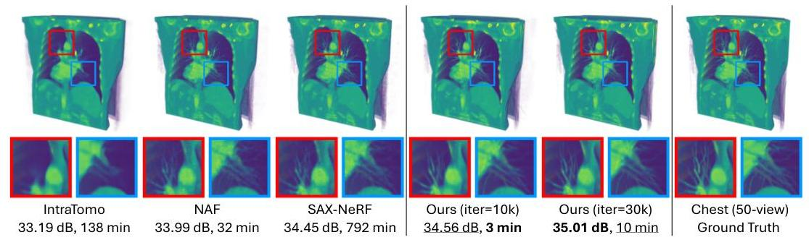

Figure 1: We compare our method to state-of-the-art NeRF-based methods (IntraTomo [66], NAF [67], SAX-NeRF [6]) in terms of visual quality, PSNR (dB), and training time (minute). Our method achieves the highest reconstruction quality and is significantly faster than other methods.

Recently, 3D Gaussian splatting (3DGS) [23] has outperformed NeRF in both quality and efficiency for view synthesis [64, 38, 31] and surface reconstruction [16, 18, 65]. However, attempts to apply the 3DGS technique to volumetric reconstruction tasks, such as X-ray tomography, are limited and ineffective. Some concurrent works [7, 14] empirically modify 3DGS for X-ray view synthesis, but they treat it solely as a data augmentation tool for traditional tomography algorithms. To date, there is no 3DGS-based method for direct CT reconstruction.

In this paper, we reveal an inherent **integration bias** in 3DGS. This bias, despite having a negligible impact on image rendering, critically hampers volumetric reconstruction. To be more specific, we will show in Sec. 4.2.1 that the standard 3DGS overlooks a covariance-related scaling factor when splatting a 3D Gaussian kernel onto the 2D image plane. This formulation leads to inconsistent volumetric properties queried from different views. Besides the integration bias, there are other challenges in applying 3DGS to tomography, such as the difference between natural light and X-ray imaging and the lack of an effective technique to query volumes from kernels.

We propose R2-Gaussian (Rectified Radiative Gaussians) to extend 3DGS to sparse-view tomographic reconstruction. R2-Gaussian achieves a bias-free training pipeline with three significant improvements. **Firstly**, we introduce a novel radiative Gaussian kernel, which acts as a local density field parameterized by central density, position, and covariance. We initialize Gaussian parameters using the analytical method FDK [13] and optimize them with photometric losses. **Secondly**, we rectify the 3DGS rasterizer to support X-ray imaging. This is achieved by deriving new X-ray rendering functions and correcting the integration bias for accurate density retrieval. **Thirdly**, we develop a CUDA-based differentiable voxelizer, which not only extracts 3D volumes from Gaussians but also enables voxel-based regularization during training. We evaluate R2-Gaussian on both synthetic and real-world datasets. Extensive experiments demonstrate that our method surpasses state-of-the-art (SOTA) methods within 4 minutes, which is 12× faster than the most efficient NeRF-based solution, NAF [67] and comparable to traditional algorithms. It converges to optimal results in 15 minutes, improving PSNR by 0.6 dB compared to SOTA methods. A visual comparison is shown in Fig. 1.

Our contributions can be summarized as follows: (1) We discover a previously unknown integration bias in 3DGS that impedes volumetric reconstruction. (2) We propose the first 3DGS-based tomography framework by introducing new kernels, extending rasterization to X-ray imaging, and developing a differentiable voxelizer. (3) Our method significantly outperforms state-of-the-art methods in both reconstruction quality and training speed, highlighting its practical value.

## 2 Related work

**Tomographic reconstruction** Computed tomography (CT) is widely used for non-intrusive inspection in medicine [17, 22], biology [12, 39, 24], and industry [11]. Conventional fan-beam CT produces a 3D volume by reconstructing each slice from 1D projection arrays. Recently, the cone-beam scanner has become popular for its fast scanning and high resolution [52], leading to the demand for 3D tomography, i.e., recovering the volume directly from 2D projection images. Our work focuses on 3D sparse-view reconstruction where less than a hundred projections are captured to reduce radiation exposure. Traditional algorithms are mainly grouped into analytical and iterative methods. Analytical

---

methods like filtered back projection (FBP) and its 3D variant FDK [13] produce results instantly (< 1 second) by solving the Radon transform and its inverse [46]. However, they introduce serious streak artifacts in sparse-view scenarios. Iterative methods [2; 55; 40; 51] formulate tomography as a maximum-a-posteriori problem and iteratively minimize the energy function with regularizations. They successfully suppress artifacts but take longer time (< 10 minutes) and lose structure details. Deep learning methods can be categorized as supervised and self-supervised families. Supervised methods learn semantic priors from CT datasets. They then use the trained networks to inpaint projections [3; 15], denoise volumes [10; 28; 35; 37] or directly output results [19; 63; 1; 32; 33]. Supervised learning methods perform well in cases similar to training sets but suffer from poor generation ability when applied to unseen data. To overcome this limitation, some studies [67; 66; 48; 6; 54] handle tomography in a self-supervised learning fashion. Inspired by NeRF [43], they model the density field with coordinate-based networks and optimize them with photometric losses. Although NeRF-based methods excel in per-case reconstruction, they are time-consuming (>30 minutes) due to the extensive point sampling in volume rendering. Our work can be put into the self-supervised learning family, but it greatly accelerates the training process and improves reconstruction quality.

3DGS 3D Gaussian splatting [23] outperforms NeRF in speed by leveraging highly parallelized rasterization for image rendering. 3DGS represents objects with a set of trainable Gaussian-shaped primitives. It has achieved great success in RGB tasks, including surface reconstruction [16; 18; 65], dynamic scene modeling [60; 34; 61], human avatar [36; 30; 27], 3D generation [57; 62; 9], etc. Some concurrent works have extended 3DGS to X-ray imaging. X-Gaussian [7] modify 3DGS to synthesize novel-view X-ray projections. Gao et al. [14] improve X-Gaussian by considering complex noise-inducing physical effects. While they produce plausible 2D X-ray projections, they cannot directly extract 3D density volumes from trained Gaussians. Instead, they first augment projections with 3DGS, and then use traditional algorithms such as FDK for CT reconstruction, which is neither efficient nor effective. Li et al. [29] represent the density field with customized Gaussian kernels, but they replace the efficient rasterization with existing CT simulators. In comparison, our work can both rasterize X-ray projections and voxelize density volumes from Gaussians.

## 3 Preliminary

### 3.1 X-ray imaging

A projection $\mathbf{I}\in\mathbb{R}^{H\times W}$ measures ray attenuation through the material as shown in Fig. 2. For an X-ray $\mathbf{r}(t)=\mathbf{o}+t\mathbf{d}\in\mathbb{R}^{3}$ with initial intensity $I_{0}$ and path bounds $t_{n}$ and $t_{f}$, the corresponding raw pixel value $I^{\prime}(\mathbf{r})$ is given with the Beer-Lambert Law [20] by: $I^{\prime}(\mathbf{r})=I_{0}\exp(-\int_{t_{n}}^{t_{f}}\sigma(\mathbf{r}(t))~d{t})$. Here, $\sigma(\mathbf{x})$ is the isotropic density (or attenuation coefficient in physics) at position $\mathbf{x}\in\mathbb{R}^{3}$. Tomography typically transforms raw data to the logarithmic space for computational simplicity, i.e.,

$I(\mathbf{r})=\log I_{0}-\log I^{\prime}(\mathbf{r})=\int_{t_{n}}^{t_{f}}\sigma(\mathbf{r}(t))d{t},$ (1)

where each pixel value $I(\mathbf{r})$ represents the density integral along the ray path. Except otherwise specified, we use the logarithmic projections as inputs. The goal of tomographic reconstruction is to estimate the 3D distribution of $\sigma(\mathbf{x})$, output as a discrete volume, with X-ray projections $\{\mathbf{I}_{i}\}_{i=1,\cdots,N}$ captured from $N$ different angles. Note that real-world projections contain minor anisotropic physical effects such as Compton scattering. Following previous works [13; 2; 55; 67], we do not explicitly model them but treat them as noise during the reconstruction.

### 3.2 3D Gaussian splatting

3D Gaussian splatting [23] models the scene with a set of 3D Gaussian kernels $\mathbb{G}^{3}=\{G_{i}^{3}\}_{i=1,\cdots,M}$, each parameterized by position, covariance, color, and opacity. A rasterizer $\mathcal{R}$ renders an RGB image

---

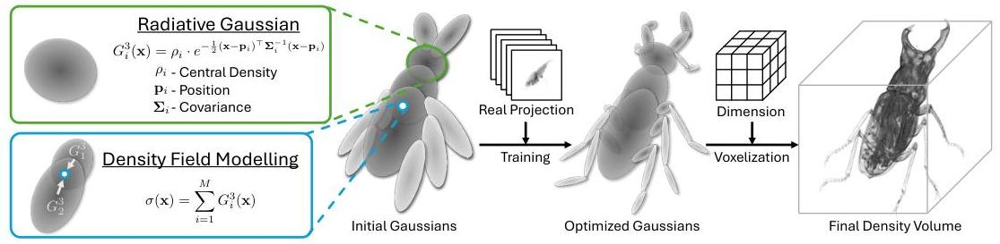

Figure 3: We represent the scanned object as a set of radiative Gaussians. We optimize them using real X-ray projections and finally retrieve the density volume with voxelization.

Irgb ∈ RH×W×3 from these Gaussians, formulated as

$$\mathbf{I}_{rgb} = \mathcal{R}(\mathbb{G}^3) = \mathcal{C} \circ \mathcal{P} \circ \mathcal{T}(\mathbb{G}^3), \tag{2}$$

where $\mathcal{T}$, $\mathcal{P}$, and $\mathcal{C}$ are the transformation, projection, and composition modules, respectively. First, $\mathcal{T}$ transforms the 3D Gaussians into the ray space, aligning viewing rays with the coordinate axis to enhance computational efficiency. The transformed 3D Gaussians are then projected onto the image plane: $\mathbb{G}^2 = \mathcal{P}(\mathbb{G}^3)$. The projected 2D Gaussian retains the same opacity and color as its 3D counterpart but omits the third row and column of position and covariance. An RGB image is then rendered by compositing these 2D Gaussians using alpha-blending [45]: $\mathbf{I}_{rgb} = \mathcal{C}(\mathbb{G}^2)$. The rasterizer is differentiable, allowing for the optimization of kernel parameters using photometric losses. 3DGS initializes sparse Gaussians with structure-from-motion (SfM) points [53]. During training, an adaptive control strategy dynamically densifies Gaussians to improve scene representation.

## 4 Method

In this section, we first introduce radiative Gaussian as a novel object representation in Sec. 4.1. Next, we adapt 3DGS to tomography in Sec. 4.2. Specifically, we derive new rasterization functions and analyze the integration bias of standard 3DGS in Sec. 4.2.1. We further develop a differentiable voxelizer for volume retrieval in Sec. 4.2.2. The optimization strategy is elaborated in Sec. 4.2.3.

### 4.1 Representing objects with radiative Gaussians

As shown in Fig. 3, we represent the target object with a group of learnable 3D kernels $\mathbb{G}^3 = \{G_i^3\}_{i=1,\cdots,M}$ that we term as radiative Gaussians. Each kernel $G_i^3$ defines a local Gaussian-shaped density field, i.e.,

$$G_i^3(\mathbf{x}|\rho_i, \mathbf{p}_i, \mathbf{\Sigma}_i) = \rho_i \cdot \exp\left(-\frac{1}{2}(\mathbf{x} - \mathbf{p}_i)^{\top}\mathbf{\Sigma}_i^{-1}(\mathbf{x} - \mathbf{p}_i)\right), \tag{3}$$

where $\rho_i$, $\mathbf{p}_i \in \mathbb{R}^3$ and $\mathbf{\Sigma}_i \in \mathbb{R}^{3 \times 3}$ are learnable parameters representing central density, position and covariance, respectively. For optimization purposes, we follow [23] to further decompose the covariance matrix $\mathbf{\Sigma}_i$ into the rotation matrix $\mathbf{R}_i$ and scale matrix $\mathbf{S}_i$: $\mathbf{\Sigma}_i = \mathbf{R}_i \mathbf{S}_i \mathbf{S}_i^{\top} \mathbf{R}_i^{\top}$. The overall density at position $\mathbf{x} \in \mathbb{R}^3$ is then computed by summing the density contribution of kernels:

$$\sigma(\mathbf{x}) = \sum_{i=1}^{M} G_i^3(\mathbf{x}|\rho_i, \mathbf{p}_i, \mathbf{\Sigma}_i). \tag{4}$$

Compared with standard 3DGS, our kernel formulation removes view-dependent color because X-ray attenuation depends only on isotropic density, as shown in Eq. (1). More importantly, we define the density query function (Eq. (4)) for radiative Gaussians, making them useful for both 2D image rendering and 3D volume reconstruction. In contrast, the opacity in 3DGS is empirically designed for RGB rendering, leading to challenges when extracting 3D models such as meshes from Gaussians [16, 8, 65]. Concurrent work [29] also explores kernel-based representation but uses simplified isotropic Gaussians. Our work employs a general Gaussian distribution, offering more flexibility and precision in modeling complex structures.

---

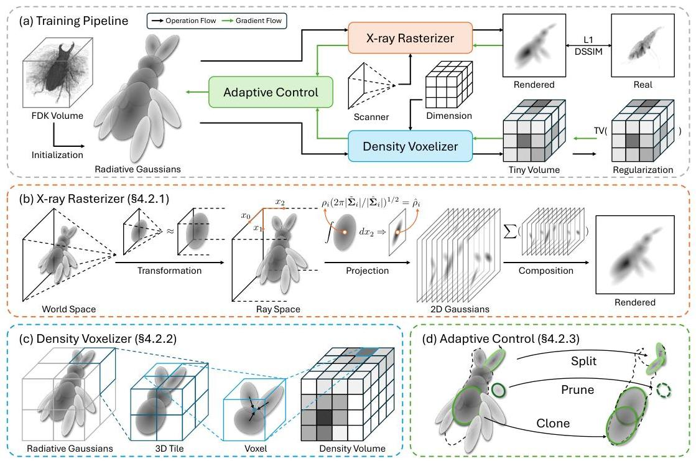

Figure 4: Training pipeline of R2-Gaussian. (a) Overall training pipeline. (b) X-ray rasterization for projection rendering. (c) Density voxelization for volume retrieval. (d) Modified adaptive control.

**Initialization** 3DGS initializes Gaussians with SfM points, which is not applicable to volumetric tomography. Instead, we initialize our radiative Gaussians using preliminary results obtained from the analytical method. Specifically, we use FDK [13] to reconstruct a low-quality volume in less than 1 second. We then exclude empty spaces with a density threshold τ and randomly sample M points as kernel positions. Following [23], we set the scales of Gaussians as the nearest neighbor distances and assume no rotation. The central densities are queried from the FDK volume. We empirically scale down the queried densities with k to compensate for the overlay between kernels.

### 4.2 Training radiative Gaussians

Our training pipeline is shown in Fig. 4. Radiative Gaussians are first initialized from an FDK volume. We then rasterize projections for photometric losses and voxelize tiny density volumes for 3D regularization. Adaptive control is used to densify Gaussians for better representation. After training, we voxelize density volumes of the target size for evaluation.

#### 4.2.1 X-ray rasterization

This section focuses on the theoretical derivation of X-ray rasterization R. As discussed in Sec. 3.1, the pixel value of a projection is the integral of density along the corresponding ray path. We substitute Eq. (4) into Eq. (1), yielding

$$I_r(\mathbf{r}) = \int \sum_{i=1}^M G_i^3(\mathbf{r}(t) | \rho_i, \mathbf{p}_i, \Sigma_i) dt = \sum_{i=1}^M \int G_i^3(\mathbf{r}(t) | \rho_i, \mathbf{p}_i, \Sigma_i) dt,$$

where Ir(r) is the rendered pixel value. This implies that we can individually integrate each 3D Gaussian to rasterize an X-ray projection. Note that tn and tf in Eq. (1) are neglected because we assume all Gaussians are bounded inside the target space.

**Transformation** Since a cone-beam X-ray scanner can be modeled similarly to a pinhole camera, we follow [69] to transfer Gaussians from the world space to the ray space. In ray space, the

---

viewing rays are parallel to the third coordinate axis, facilitating analytical integration. Due to the non-Cartesian nature of ray space, we employ the local affine transformation to Eq. (5), yielding

$I_{r}(\mathbf{r}) \approx \sum_{i=1}^{M} \int G_{i}^{3}\left(\tilde{\mathbf{x}} \mid \rho_{i}, \underbrace{\phi(\mathbf{p})}_{\tilde{\mathbf{p}}_{i}}\right.$, $\underbrace{\mathbf{J}_{i} \mathbf{W} \boldsymbol{\Sigma}_{i} \mathbf{W}^{\top} \mathbf{J}_{i}^{\top}}_{\tilde{\mathbf{\Sigma}}_{i}}\left) d x_{2}\right.$,
where $\tilde{\mathbf{x}}=\left[x_{0}, x_{1}, x_{2}\right]^{\top}$ is a point in ray space, $\tilde{\mathbf{p}}_{i} \in \mathbb{R}^{3}$ is the new Gaussian position obtained through projective mapping $\phi$, and $\tilde{\boldsymbol{\Sigma}}_{i} \in \mathbb{R}^{3 \times 3}$ is the new Gaussian covariance controlled by local approximation matrix $\mathbf{J}_{i}$ and viewing transformation matrix $\mathbf{W}$. Refer to Appendix A for determining $\phi, \mathbf{J}_{i}$, and $\mathbf{W}$ from scanner parameters.

Projection and composition A good property of normalized 3D Gaussian distribution is that its integral along one coordinate axis yields a normalized 2D Gaussian distribution. Substitute Eq. (3) into Eq. (6) and we have

$$
\begin{aligned}
I_{r}(\mathbf{r}) & \approx \sum_{i=1}^{M} \rho_{i}(2 \pi)^{\frac{3}{2}}\left|\tilde{\boldsymbol{\Sigma}}_{i}\right|^{\frac{1}{2}} \underbrace{\frac{1}{(2 \pi)^{\frac{3}{2}}\left|\tilde{\boldsymbol{\Sigma}}_{i}\right|^{\frac{1}{2}}} \exp \left(-\frac{1}{2}\left(\tilde{\mathbf{x}}-\tilde{\mathbf{p}}_{i}\right)^{\top} \tilde{\boldsymbol{\Sigma}}_{i}^{-1}\left(\tilde{\mathbf{x}}-\tilde{\mathbf{p}}_{i}\right)\right)}_{\text {Normalized 3D Gaussian distribution }} d x_{2} \\
& =\sum_{i=1}^{M} \rho_{i}(2 \pi)^{\frac{3}{2}}\left|\tilde{\boldsymbol{\Sigma}}_{i}\right|^{\frac{1}{2}} \underbrace{\frac{1}{2 \pi\left|\tilde{\boldsymbol{\Sigma}}_{i}\right|^{\frac{1}{2}}} \exp \left(-\frac{1}{2}\left(\tilde{\mathbf{x}}-\tilde{\mathbf{p}}_{i}\right)^{\top} \tilde{\boldsymbol{\Sigma}}_{i}^{-1}\left(\tilde{\mathbf{x}}-\tilde{\mathbf{p}}_{i}\right)\right)}_{\text {Normalized 2D Gaussian distribution }} \\
& =\sum_{i=1}^{M} G_{i}^{2}\left(\tilde{\mathbf{x}} \mid \sqrt{\frac{2 \pi\left|\tilde{\boldsymbol{\Sigma}}_{i}\right|}{\left|\tilde{\boldsymbol{\Sigma}}_{i}\right|}} \rho_{i}, \tilde{\mathbf{p}}_{i}, \tilde{\boldsymbol{\Sigma}}_{i}\right)
\end{aligned}
$$

where $\tilde{\mathbf{x}} \in \mathbb{R}^{2}, \tilde{\mathbf{p}} \in \mathbb{R}^{2}, \hat{\boldsymbol{\Sigma}} \in \mathbb{R}^{2 \times 2}$ are obtained by dropping the third rows and columns of their counterparts $\tilde{\mathbf{x}}, \tilde{\mathbf{p}}$, and $\hat{\boldsymbol{\Sigma}}$, respectively. Eq. (7) shows that an X-ray projection can be rendered by simply summing 2D Gaussians instead of alpha-compositing them in natural light imaging.

Integration bias During the projection, a key difference between our 2D Gaussian and the original one in 3DGS is the central density (opacity) $\hat{\rho}_{i}$. As shown in Eq. (7), we scale the density with a covariance-related factor $\mu_{i}=\left(2 \pi\left|\tilde{\boldsymbol{\Sigma}}_{i}\right| /\left|\tilde{\boldsymbol{\Sigma}}_{i}\right|\right)^{1 / 2}: \hat{\rho}_{i}=\mu_{i} \rho_{i}$, while 3DGS does not. This implies that 3DGS, in fact, learns an integrated density in the 2D image plane rather than the actual one in 3D space. This integration bias, though having a negligible impact on imaging rendering, leads to significant inconsistency in density retrieval. We demonstrate the inconsistency with a simplified 2D-to-1D projection in Fig. 5. When attempting to recover the central density $\rho$ in 3D space with $\rho_{i}=\hat{\rho}_{i} / \mu_{j}$, we find different views $\left(\mu_{j}\right)$ lead to different results. This violates the isotropic nature of $\rho_{i}$, preventing us from determining the correct value. In contrast, our method assigns the actual 3D density to the kernel and forwardly computes the 2D projection, thus fundamentally solving the issue. While conceptually simple, implementing our idea requires substantial engineering efforts, including reprogramming all backpropagation routines in CUDA.

# 4.2.2 Density voxelization 

We develop a voxelizer $\mathcal{V}$ to efficiently query a density volume $\mathbf{V} \in \mathbb{R}^{X \times Y \times Z}$ from radiative Gaussians: $\mathbf{V}=\mathcal{V}\left(\mathbb{G}^{3}\right)$. Inspired by voxelizers used in RGB tasks [57], our voxelizer first partitions the target space into multiple $8 \times 8 \times 8$ 3D tiles. It then culls Gaussians, retaining those with a $99 \%$ confidence of intersecting the tile. In each 3D tile, voxel values are parallelly computed by summing the contributions of nearby kernels with Eq. (4). We implement the voxelizer and its backpropagation in CUDA, making it differentiable for optimization. This design not only accelerates the query process ( $>100$ FPS) but also allows us to regularize radiative Gaussians with 3D priors.

---

Table 1: Quantitative results on sparse-view tomography. We colorize the best, second-best, and third-best numbers.

| Methods | 75-view | | | 50-view | | | 25-view | | |
| --- | --- | --- | --- | --- | --- | --- | --- | --- | --- |
| | PSNR $\uparrow$ | SSIM $\uparrow$ | Time $\downarrow$ | PSNR $\uparrow$ | SSIM $\uparrow$ | Time $\downarrow$ | PSNR $\uparrow$ | SSIM $\uparrow$ | Time $\downarrow$ |
| Synthetic dataset | | | | | | | | | | |
| FDK [13] | 28.63 | 0.497 | - | 26.50 | 0.422 | - | 22.99 | 0.317 | - |
| SART [2] | 36.06 | 0.897 | 4 m 41 s | 34.37 | 0.875 | 3 m 36 s | 31.14 | 0.825 | 1 m 47 s |
| ASD-POCS [55] | 36.64 | 0.940 | 2 m 25 s | 34.34 | 0.914 | 1 m 52 s | 30.48 | 0.847 | 56 s |
| IntraTomo [66] | 35.42 | 0.924 | 2 h 7 m | 35.25 | 0.923 | 2 h 9 m | 34.68 | 0.914 | 2 h 19 m |
| NAF [67] | 37.84 | 0.945 | 30 m 43 s | 36.65 | 0.932 | 32 m 4 s | 33.91 | 0.893 | 31 m 1 s |
| SAX-NeRF [6] | 38.07 | 0.950 | 13 h 5 m | 36.86 | 0.938 | 13 h 5 m | 34.33 | 0.905 | 13 h 3 m |
| Ours (iter=10k) | 38.29 | 0.954 | 2 m 38 s | 37.63 | 0.949 | 2 m 35 s | 35.08 | 0.922 | 2 m 35 s |
| Ours (iter=30k) | 38.88 | 0.959 | 8 m 21 s | 37.98 | 0.952 | 8 m 14 s | 35.19 | 0.923 | 8 m 28 s |
| Real-world dataset | | | | | | | | | | |
| FDK [13] | 30.03 | 0.535 | - | 27.38 | 0.449 | - | 23.30 | 0.335 | - |
| SART [2] | 34.42 | 0.845 | 5 m 11 s | 33.61 | 0.827 | 3 m 28 s | 31.52 | 0.790 | 1 m 47 s |
| ASD-POCS [55] | 36.33 | 0.868 | 2 m 43 s | 34.58 | 0.861 | 1 m 49 s | 31.32 | 0.810 | 56 s |
| IntraTomo [66] | 36.79 | 0.858 | 2 h 25 m | 36.99 | 0.854 | 2 h 19 m | 35.85 | 0.835 | 2 h 18 m |
| NAF [67] | 38.58 | 0.848 | 51 m 28 s | 36.44 | 0.818 | 51 m 31 s | 32.92 | 0.772 | 51 m 24 s |
| SAX-NeRF [6] | 34.93 | 0.854 | 13 h 21 m | 34.89 | 0.840 | 13 h 23 m | 33.49 | 0.793 | 13 h 25 m |
| Ours (iter=10k) | 38.10 | 0.872 | 3 m 39 s | 37.52 | 0.866 | 3 m 37 s | 35.10 | 0.840 | 3 m 23 s |
| Ours (iter=30k) | 39.40 | 0.875 | 14 m 16 s | 38.24 | 0.864 | 13 m 52 s | 34.83 | 0.833 | 12 m 56 s |

# 4.2.3 Optimization 

We optimize radiative Gaussians using stochastic gradient descent. Besides photometric L1 loss $\mathcal{L}_{1}$ and D-SSIM loss $\mathcal{L}_{\text {ssim }}$ [59], we further incorporate a 3D total variation (TV) regularization [49] $\mathcal{L}_{t v}$ as a homogeneity prior for tomography. At each training iteration, we randomly query a tiny density volume $\mathbf{V}_{t v} \in \mathbb{R}^{D \times D \times D}$ (same spacing as the target output) and minimize its total variation. The overall training loss is defined as:

$$
\mathcal{L}_{\text {total }}=\mathcal{L}_{1}\left(\mathbf{I}_{r}, \mathbf{I}_{m}\right)+\lambda_{\text {ssim }} \mathcal{L}_{\text {ssim }}\left(\mathbf{I}_{r}, \mathbf{I}_{m}\right)+\lambda_{t v} \mathcal{L}_{t v}\left(\mathbf{V}_{t v}\right)
$$

where $\mathbf{I}_{r}, \mathbf{I}_{m}, \lambda_{\text {ssim }}$ and $\lambda_{t v}$ are rendered projection, measured projection, D-SSIM weight, and TV weight, respectively. Adaptive control is employed during training to enhance object representation. We remove empty Gaussians and densify (clone or split) those with large loss gradients. Considering objects such as human organs have extensive homogeneous areas, we do not prune large Gaussians. As for densification, we halve the densities of both original and replicated Gaussians. This strategy mitigates the sudden performance drop caused by new Gaussians and hence stabilizes training.

## 5 Experiments

### 5.1 Experimental settings

Dataset We conduct experiments on both synthetic and real-world datasets. For the synthetic dataset, we collect 15 real CT volumes, ranging from organisms to artificial objects. We then use the tomography toolbox TIGRE [5] to synthesize X-ray projections and add Compton scatter and electric noise. For real-world experiments, we use three cases from the FIPS dataset [56], each with 721 real projections. Since ground truth volumes are unavailable, we use FDK [13] to create pseudo-ground truth using all views and then subsample views for sparse-view experiments. We set 75, 50, and 25 views for both synthetic and real-world data as three sparse-view scenarios. Refer to Appendix B for more details of datasets.

Implementation details Our R ${ }^{2}$-Gaussian is implemented in PyTorch [44] and CUDA [50], and trained with the Adam optimizer [25] for 30k iterations. Learning rates for position, density, scale, and rotation are initially set as $0.0002,0.01,0.005$, and 0.001 , respectively, and exponentially to 0.1 of their initial values. Loss weights are $\lambda_{\text {ssim }}=0.25$ and $\lambda_{t v}=0.05$. We initialize $M=50 \mathrm{k}$ Gaussians with a density threshold $\tau=0.05$ and scaling term $k=0.15$. The TV volume size is

---

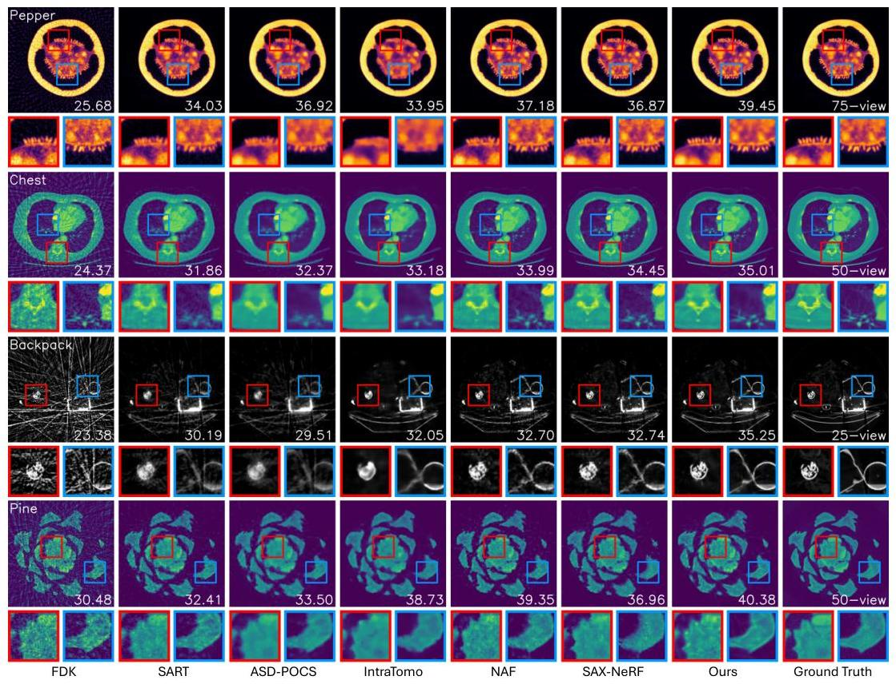

Figure 6: Colorized slice examples of different methods with PSNR (dB) shown at the bottom right of each image. The first three rows are from the synthetic dataset and the last row is from the real-world dataset. Our method recovers more details and suppresses artifacts.
$D=32$. Adaptive control runs from 500 to 15 k iterations with a gradient threshold of 0.00005 . All methods run on a single RTX3090 GPU. We evaluate reconstruction quality using PSNR and SSIM [59], with PSNR calculated in 3D volume and SSIM averaged over 2D slices in axial, coronal, and sagittal directions. We also report the running time as a reflection of efficiency.

# 5.2 Results and evaluation 

For fairness, we do not compare methods that require external training data but focus on those that solely use 2D projections of arbitrary objects. We compare $\mathrm{R}^{2}$-Gaussian with three traditional methods (FDK [13], SART [2], ASD-POCS [55]) and three SOTA NeRF-based methods (IntraTomo [66], NAF [67], SAX-NeRF [6]). Tab. 1 reports the quantitative results on sparse-view tomography. Note that we do not report the running time for FDK as it is instant. $\mathrm{R}^{2}$-Gaussian achieves the best performance across all synthetic and most real-world experiments. Specifically, our method delivers a 0.93 dB higher PSNR than SAX-NeRF, on the synthetic dataset, and a 0.95 dB improvement over IntraTomo on the real-world dataset. It is also worth noting that our 50 -view results are already on par with the 75 -view results of other methods. Regarding efficiency, our method converges to optimal results in 15 minutes, which is $3.7 \times$ faster than the most efficient NeRF-based method, NAF. Surprisingly, it takes less than 4 minutes to surpass other methods, which is even faster than the traditional algorithm SART. Fig. 6 shows the visual comparisons of different methods. FDK and SART introduce streak artifacts, while ASD-POCS and IntraTomo blur structural details. NAF and SAX-NeRF are better than other baseline methods but have salt-and-pepper noise. In comparison, our method successfully recovers sharp details, e.g., ovules of pepper, and maintains good smoothness for homogeneous areas, e.g., muscles in the chest.

---

Table 2: Quantitative results of X-3DGS and our method on the synthetic dataset.

|  | 75-view | 50-view | 25-view |
| --- | --- | --- | --- |
| X-3DGS | Ours | X-3DGS | Ours | X-3DGS | Ours |
| 2D PSNR $\uparrow$ | 49.97 | 50.54 | 47.26 | 49.70 | 39.84 | 46.28 |
| 2D SSIM $\uparrow$ | 0.987 | 0.986 | 0.984 | 0.986 | 0.967 | 0.982 |
| 3D PSNR $\uparrow$ | 23.40 | 38.86 | 21.24 | 37.98 | 14.07 | 35.17 |
| 3D SSIM $\uparrow$ | 0.660 | 0.959 | 0.562 | 0.952 | 0.408 | 0.923 |

# 5.3 Ablation study 

Integration bias To demonstrate the impact of integration bias discussed in Sec. 4.2.1, we develop an X-ray version of 3DGS (X-3DGS) that uses X-ray rendering while retaining the biased 3D-to-2D Gaussian projection. We use the same voxelizer in Sec. 4.2.2 to extract volumes. Before voxelization, we divide the learned density of each Gaussian by the mean scaling factor $\mu$ of all training views. Tab. 2 shows that rectifying integration bias benefits both 2D rendering ( $+3.15 \mathrm{~dB}$ PSNR) and 3D reconstruction ( $+17.77 \mathrm{~dB}$ PSNR). Fig. 7 visualize rendering and reconstruction results. While X-3DGS renders reasonable 2D projections, its reconstruction quality is significantly worse than ours. Besides, there are notable discrepancies in slices queried from different views. The conflicting 2D and 3D performances indicate that X-3DGS, despite fitting images well, does not accurately model the density field. In contrast, our method learns the actual view-independent density, eliminating inconsistencies and ensuring unbiased object representation.

Component analysis We conduct ablation experiments to assess the effect of FDK initialization (Init.), modified adaptive control (AC), and total variation regularization (Reg.) on performance. The baseline model excludes these components and uses randomly generated Gaussians for initialization. Experiments are performed under the 50-view condition, evaluating PSNR, SSIM, training time, and Gaussian count (Gau.). Results are listed in Tab. 3. FDK initialization boosts PSNR by 0.9 dB . Adaptive control improves quality but prolongs training due to more Gaussians. TV regularization increases SSIM by reducing artifacts and promoting smoothness. Overall, our full model outperforms the baseline, improving PSNR by 1.51 dB and SSIM by 0.018 , with training time under 9 minutes.

Parameter analysis We perform parameter analysis on the number of initialized Gaussians $M$, TV loss weight $\lambda_{t v}$, and TV volume size $D$. The results are shown in the last three blocks of Tab. 3. $\mathrm{R}^{2}$-Gaussian achieves good quality-efficiency balance at 50 k initialized Gaussians. A TV loss weight of $\lambda_{t v}=0.05$ improves reconstruction, but larger values can lead to degradation. The training time increases with TV volume size while the performance peaks at $D=32$.

Convergence analysis Fig. 8 compares the results of NeRF-based methods and our $\mathrm{R}^{2}$-Gaussian method at different iterations. Our method, both with and without FDK initialization, converges significantly faster, displaying sharp details by the 500th iteration when other methods still exhibit artifacts and blurriness. Notably, the FDK initialization offers a rough structure before training, which
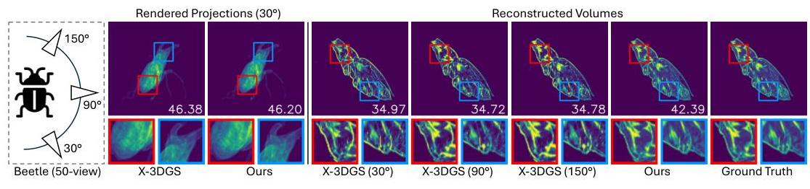

Figure 7: Results of X-3DGS and our method with PSNR (dB) indicated on each image. We show slices of X-3DGS queried from three viewing angles. Although X-3DGS can produce plausible X-ray projections, its reconstructed volume lacks view consistency and exhibits poor quality.

---

Table 3: Ablation results with our choices in bold.

| Synthetic | PSNR $\uparrow$ | SSIM $\uparrow$ | Time $\downarrow$ | Gau. |
| :--: | :--: | :--: | :--: | :--: |
| Baseline (B) | 36.47 | 0.934 | 4m57s | 50k |
| B+Init. | 37.37 | 0.944 | 5m29s | 50k |
| B+AC | 37.33 | 0.942 | 7m33s | 70k |
| B+Reg. | 36.79 | 0.943 | 6m30s | 50k |
| Full model | 37.98 | 0.952 | 8m37s | 68k |
| $M=5 \mathrm{k}$ | 37.44 | 0.946 | 9m18s | 32k |
| $M=10 \mathrm{k}$ | 37.56 | 0.948 | 8m59s | 35k |
| $M=50 \mathrm{k}$ | 37.98 | 0.952 | 8m14s | 68k |
| $M=100 \mathrm{k}$ | 38.03 | 0.953 | 9m4s | 112k |
| $M=200 \mathrm{k}$ | 37.82 | 0.949 | 9m54s | 206k |
| $\lambda_{\text {tv }}=0$ | 37.66 | 0.948 | 7m9s | 68k |
| $\lambda_{\text {tv }}=0.01$ | 37.88 | 0.950 | 8m21s | 68k |
| $\lambda_{\text {tv }}=0.05$ | 37.98 | 0.952 | 8m14s | 68k |
| $\lambda_{\text {tv }}=0.1$ | 37.73 | 0.951 | 8m11s | 68k |
| $\lambda_{\text {tv }}=0.15$ | 37.40 | 0.949 | 8m27s | 69k |
| $D=8$ | 37.74 | 0.949 | 7m56s | 68k |
| $D=16$ | 37.94 | 0.950 | 8m18s | 68k |
| $D=32$ | 37.98 | 0.952 | 8m14s | 68k |
| $D=48$ | 37.90 | 0.951 | 9m34s | 67k |
| $D=64$ | 37.82 | 0.949 | 11m35s | 67k |

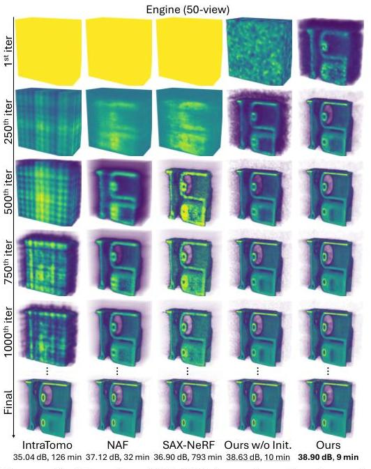

Figure 8: Results of NeRF-based methods and our $\mathrm{R}^{2}$-Gaussian at different iterations.
further accelerates convergence and enhances reconstruction quality. Finally, our method outperforms others in both performance and efficiency, achieving the highest PSNR of 38.90 dB in 9 minutes.

# 6 Discussion and conclusion 

Discussion $\mathrm{R}^{2}$-Gaussian inherits some limitations from 3DGS, such as varying training time across modalities, needle-like artifacts under extremely sparse-view conditions, and suboptimal extrapolation for other tomography tasks. Besides, we have not considered calibration errors regarding the scanned geometry and anisotropic physical effects such as Compton scattering. More details are discussed in Appendix E. Despite these limitations, our method's superior performance and fast speed make it valuable for real-world applications for medical diagnosis and industrial inspection.

Conclusion This paper presents $\mathrm{R}^{2}$-Gaussian, a novel 3DGS-based framework for sparse-view tomographic reconstruction. We identify and rectify a previously overlooked integration bias of standard 3DGS, which hinders accurate density retrieval. Furthermore, we enhance 3DGS for tomography by introducing new kernels, devising X-ray rasterization functions, and developing a differentiable voxelizer. Our $\mathrm{R}^{2}$-Gaussian surpasses state-of-the-art methods in both reconstruction quality and training speed, demonstrating its potential for real-world applications. Crucially, we speculate that the newly found integration bias may be pervasive across all 3DGS-related research. Consequently, our rectification technique could benefit more tasks beyond computed tomography.

## Acknowledgments

The research is funded in part by ARC Discovery Grant (grant ID: DP220100800) of the Australia Research Council.

## References

[1] Jonas Adler and Ozan Öktem. Learned primal-dual reconstruction. IEEE transactions on medical imaging, 37(6):1322-1332, 2018.

---

[2] Anders H Andersen and Avinash C Kak. Simultaneous algebraic reconstruction technique (sart): a superior implementation of the art algorithm. Ultrasonic imaging, 6(1):81-94, 1984.
[3] Rushil Anirudh, Hyojin Kim, Jayaraman J Thiagarajan, K Aditya Mohan, Kyle Champley, and Timo Bremer. Lose the views: Limited angle ct reconstruction via implicit sinogram completion. In Proceedings of the IEEE Conference on Computer Vision and Pattern Recognition, pages 6343-6352, 2018.
[4] Samuel G Armato III, Geoffrey McLennan, Luc Bidaut, Michael F McNitt-Gray, Charles R Meyer, Anthony P Reeves, Binsheng Zhao, Denise R Aberle, Claudia I Henschke, Eric A Hoffman, et al. The lung image database consortium (lidc) and image database resource initiative (idri): a completed reference database of lung nodules on ct scans. Medical physics, 38(2):915-931, 2011.
[5] Ander Biguri, Manjit Dosanjh, Steven Hancock, and Manuchehr Soleimani. Tigre: a matlab-gpu toolbox for cbct image reconstruction. Biomedical Physics \& Engineering Express, 2(5):055010, 2016.
[6] Yuanhao Cai, Jiahao Wang, Alan Yuille, Zongwei Zhou, and Angtian Wang. Structure-aware sparse-view x-ray 3d reconstruction. In Proceedings of the IEEE/CVF Conference on Computer Vision and Pattern Recognition, 2024.
[7] Yuanhao Cai, Yixun Liang, Jiahao Wang, Angtian Wang, Yulun Zhang, Xiaokang Yang, Zongwei Zhou, and Alan Yuille. Radiative gaussian splatting for efficient x-ray novel view synthesis. In European Conference on Computer Vision, pages 283-299. Springer, 2025.
[8] Hanlin Chen, Chen Li, and Gim Hee Lee. Neusg: Neural implicit surface reconstruction with 3d gaussian splatting guidance. arXiv preprint arXiv:2312.00846, 2023.
[9] Zilong Chen, Feng Wang, and Huaping Liu. Text-to-3d using gaussian splatting. In Proceedings of the IEEE/CVF Conference on Computer Vision and Pattern Recognition, 2024.
[10] Hyungjin Chung, Dohoon Ryu, Michael T McCann, Marc L Klasky, and Jong Chul Ye. Solving 3d inverse problems using pre-trained 2d diffusion models. In Proceedings of the IEEE/CVF Conference on Computer Vision and Pattern Recognition, pages 22542-22551, 2023.
[11] Leonardo De Chiffre, Simone Carmignato, J-P Kruth, Robert Schmitt, and Albert Weckenmann. Industrial applications of computed tomography. CIRP annals, 63(2):655-677, 2014.
[12] Philip CJ Donoghue, Stefan Bengtson, Xi-ping Dong, Neil J Gostling, Therese Huldtgren, John A Cunningham, Chongyu Yin, Zhao Yue, Fan Peng, and Marco Stampanoni. Synchrotron x-ray tomographic microscopy of fossil embryos. Nature, 442(7103):680-683, 2006.
[13] Lee A Feldkamp, Lloyd C Davis, and James W Kress. Practical cone-beam algorithm. Josa a, 1 (6):612-619, 1984.
[14] Zhongpai Gao, Benjamin Planche, Meng Zheng, Xiao Chen, Terrence Chen, and Ziyan Wu. Ddgs-ct: Direction-disentangled gaussian splatting for realistic volume rendering. arXiv preprint arXiv:2406.02518, 2024.
[15] Muhammad Usman Ghani and W Clem Karl. Deep learning-based sinogram completion for low-dose ct. In 2018 IEEE 13th Image, Video, and Multidimensional Signal Processing Workshop (IVMSP), pages 1-5. IEEE, 2018.
[16] Antoine Guédon and Vincent Lepetit. Sugar: Surface-aligned gaussian splatting for efficient 3d mesh reconstruction and high-quality mesh rendering. In Proceedings of the IEEE/CVF Conference on Computer Vision and Pattern Recognition, 2024.
[17] Godfrey N Hounsfield. Computed medical imaging. Science, 210(4465):22-28, 1980.
[18] Binbin Huang, Zehao Yu, Anpei Chen, Andreas Geiger, and Shenghua Gao. 2d gaussian splatting for geometrically accurate radiance fields. In SIGGRAPH 2024 Conference Papers. Association for Computing Machinery, 2024. doi: 10.1145/3641519.3657428.

---

[19] Kyong Hwan Jin, Michael T McCann, Emmanuel Froustey, and Michael Unser. Deep convolutional neural network for inverse problems in imaging. IEEE transactions on image processing, 26(9):4509-4522, 2017.
[20] Avinash C Kak and Malcolm Slaney. Principles of computerized tomographic imaging. SIAM, 2001.
[21] Emma Kamutta, Sofia Mäkinen, and Alexander Meaney. Cone-Beam Computed Tomography Dataset of a Seashell, August 2022. URL https://doi.org/10.5281/zenodo.6983008.
[22] Shigehiko Katsuragawa and Kunio Doi. Computer-aided diagnosis in chest radiography. Computerized Medical Imaging and Graphics, 31(4-5):212-223, 2007.
[23] Bernhard Kerbl, Georgios Kopanas, Thomas Leimkühler, and George Drettakis. 3d gaussian splatting for real-time radiance field rendering. ACM Transactions on Graphics, 42(4):1-14, 2023.
[24] Timo Kiljunen, Touko Kaasalainen, Anni Suomalainen, and Mika Kortesniemi. Dental cone beam ct: A review. Physica Medica, 31(8):844-860, 2015.
[25] Diederik Kingma and Jimmy Ba. Adam: A method for stochastic optimization. In International Conference on Learning Representations (ICLR), San Diega, CA, USA, 2015.
[26] Pavol Klacansky. Open scivis datasets, December 2017. URL https://klacansky.com/ open-scivis-datasets/. https://klacansky.com/open-scivis-datasets/.
[27] Muhammed Kocabas, Jen-Hao Rick Chang, James Gabriel, Oncel Tuzel, and Anurag Ranjan. HUGS: Human gaussian splatting. In 2024 IEEE/CVF Conference on Computer Vision and Pattern Recognition (CVPR), 2024. URL https://arxiv.org/abs/2311.17910.
[28] Suhyeon Lee, Hyungjin Chung, Minyoung Park, Jonghyuk Park, Wi-Sun Ryu, and Jong Chul Ye. Improving 3d imaging with pre-trained perpendicular 2d diffusion models. In Proceedings of the IEEE/CVF International Conference on Computer Vision, pages 10710-10720, 2023.
[29] Yingtai Li, Xueming Fu, Shang Zhao, Ruiyang Jin, and S Kevin Zhou. Sparse-view ct reconstruction with 3d gaussian volumetric representation. arXiv preprint arXiv:2312.15676, 2023.
[30] Zhe Li, Zerong Zheng, Lizhen Wang, and Yebin Liu. Animatable gaussians: Learning pose-dependent gaussian maps for high-fidelity human avatar modeling. In Proceedings of the IEEE/CVF Conference on Computer Vision and Pattern Recognition (CVPR), 2024.
[31] Zhihao Liang, Qi Zhang, Ying Feng, Ying Shan, and Kui Jia. Gs-ir: 3d gaussian splatting for inverse rendering. Conference on Computer Vision and Pattern Recognition (CVPR), 2024.
[32] Yiqun Lin, Zhongjin Luo, Wei Zhao, and Xiaomeng Li. Learning deep intensity field for extremely sparse-view cbct reconstruction. In International Conference on Medical Image Computing and ComputerAssisted Intervention, pages 13-23. Springer, 2023.
[33] Yiqun Lin, Jiewen Yang, Hualiang Wang, Xinpeng Ding, Wei Zhao, and Xiaomeng Li. C" 2rv: Crossregional and cross-view learning for sparse-view cbct reconstruction. In Proceedings of the IEEE/CVF Conference on Computer Vision and Pattern Recognition, pages 11205-11214, 2024.
[34] Youtian Lin, Zuozhuo Dai, Siyu Zhu, and Yao Yao. Gaussian-flow: 4d reconstruction with dynamic 3d gaussian particle. In Proceedings of the IEEE/CVF Conference on Computer Vision and Pattern Recognition, 2024.
[35] Jiaming Liu, Rushil Anirudh, Jayaraman J Thiagarajan, Stewart He, K Aditya Mohan, Ulugbek S Kamilov, and Hyojin Kim. Dolce: A model-based probabilistic diffusion framework for limited-angle ct reconstruction. In Proceedings of the IEEE/CVF International Conference on Computer Vision, pages 10498-10508, 2023.
[36] Xian Liu, Xiaohang Zhan, Jiaxiang Tang, Ying Shan, Gang Zeng, Dahua Lin, Xihui Liu, and Ziwei Liu. Humangaussian: Text-driven 3d human generation with gaussian splatting. In Proceedings of the IEEE/CVF Conference on Computer Vision and Pattern Recognition, 2024.
[37] Zhengchun Liu, Tekin Bicer, Rajkumar Kettimuthu, Doga Gursoy, Francesco De Carlo, and Ian Foster. Tomogan: low-dose synchrotron x-ray tomography with generative adversarial networks: discussion. JOSA A, 37(3):422-434, 2020.

---

[38] Tao Lu, Mulin Yu, Linning Xu, Yuanbo Xiangli, Limin Wang, Dahua Lin, and Bo Dai. Scaffold-gs: Structured 3d gaussians for view-adaptive rendering. Conference on Computer Vision and Pattern Recognition (CVPR), 2024.
[39] Vladan Lučić, Friedrich Förster, and Wolfgang Baumeister. Structural studies by electron tomography: from cells to molecules. Annu. Rev. Biochem., 74:833-865, 2005.
[40] Stephen H Manglos, George M Gagne, Andrzej Krol, F Deaver Thomas, and Rammohan Narayanaswamy. Transmission maximum-likelihood reconstruction with ordered subsets for cone beam ct. Physics in Medicine \& Biology, 40(7):1225, 1995.
[41] Alexander Meaney. Cone-Beam Computed Tomography Dataset of a Pine Cone, August 2022. URL https://doi.org/10.5281/zenodo. 6985407.
[42] Alexander Meaney. Cone-beam computed tomography dataset of a walnut, August 2022. URL https: //doi.org/10.5281/zenodo. 6986012.
[43] Ben Mildenhall, Pratul P. Srinivasan, Matthew Tancik, Jonathan T. Barron, Ravi Ramamoorthi, and Ren Ng. Nerf: Representing scenes as neural radiance fields for view synthesis. In ECCV, 2020.
[44] Adam Paszke, Sam Gross, Francisco Massa, Adam Lerer, James Bradbury, Gregory Chanan, Trevor Killeen, Zeming Lin, Natalia Gimelshein, Luca Antiga, et al. Pytorch: An imperative style, highperformance deep learning library. Advances in neural information processing systems, 32, 2019.
[45] Thomas Porter and Tom Duff. Compositing digital images. In Proceedings of the 11th annual conference on Computer graphics and interactive techniques, pages 253-259, 1984.
[46] Johann Radon. On the determination of functions from their integral values along certain manifolds. IEEE transactions on medical imaging, 5(4):170-176, 1986.
[47] Holger Roth, Amal Farag, Evrim B. Turkbey, Le Lu, Jiamin Liu, and Ronald M. Summers. Data from pancreas-ct, 2016. URL https://www. cancerimagingarchive.net/collection/pancreas-ct/.
[48] Darius Rückert, Yuanhao Wang, Rui Li, Ramzi Idoughi, and Wolfgang Heidrich. Neat: Neural adaptive tomography. ACM Transactions on Graphics (TOG), 41(4):1-13, 2022.
[49] Leonid I Rudin, Stanley Osher, and Emad Fatemi. Nonlinear total variation based noise removal algorithms. Physica D: nonlinear phenomena, 60(1-4):259-268, 1992.
[50] Jason Sanders and Edward Kandrot. CUDA by example: an introduction to general-purpose GPU programming. Addison-Wesley Professional, 2010.
[51] Ken Sauer and Charles Bouman. A local update strategy for iterative reconstruction from projections. IEEE Transactions on Signal Processing, 41(2):534-548, 1993.
[52] William C Scarfe, Allan G Farman, Predag Sukovic, et al. Clinical applications of cone-beam computed tomography in dental practice. Journal-Canadian Dental Association, 72(1):75, 2006.
[53] Johannes L Schonberger and Jan-Michael Frahm. Structure-from-motion revisited. In Proceedings of the IEEE conference on computer vision and pattern recognition, pages 4104-4113, 2016.
[54] Liyue Shen, John Pauly, and Lei Xing. Nerp: implicit neural representation learning with prior embedding for sparsely sampled image reconstruction. IEEE Transactions on Neural Networks and Learning Systems, 2022.
[55] Emil Y Sidky and Xiaochuan Pan. Image reconstruction in circular cone-beam computed tomography by constrained, total-variation minimization. Physics in Medicine \& Biology, 53(17):4777, 2008.
[56] The Finnish Inverse Problems Society. X-ray tomographic datasets, 2024. URL https://fips.fi/ category/open-datasets/x-ray-tomographic-datasets/.
[57] Jiaxiang Tang, Jiawei Ren, Hang Zhou, Ziwei Liu, and Gang Zeng. Dreamgaussian: Generative gaussian splatting for efficient 3d content creation. In The Twelfth International Conference on Learning Representations, 2024. URL https://openreview.net/forum?id=UyNXMqnN3c.
[58] Pieter Verboven, Bart Dequeker, Jiaqi He, Michiel Pieters, Leroi Pols, Astrid Tempelaere, Leen Van Doorselaer, Hans Van Cauteren, Ujjwal Verma, Hui Xiao, et al. www. x-plant. org-the ct database of plant organs. In 6th Symposium on X-ray Computed Tomography: Inauguration of the KU Leuven XCT Core Facility, Location: Leuven, Belgium, 2022.

---

[59] Zhou Wang, Alan C Bovik, Hamid R Sheikh, and Eero P Simoncelli. Image quality assessment: from error visibility to structural similarity. IEEE transactions on image processing, 13(4):600-612, 2004.
[60] Guanjun Wu, Taoran Yi, Jiemin Fang, Lingxi Xie, Xiaopeng Zhang, Wei Wei, Wenyu Liu, Qi Tian, and Xinggang Wang. 4d gaussian splatting for real-time dynamic scene rendering. In Proceedings of the IEEE/CVF Conference on Computer Vision and Pattern Recognition, 2024.
[61] Ziyi Yang, Xinyu Gao, Wen Zhou, Shaohui Jiao, Yuqing Zhang, and Xiaogang Jin. Deformable 3d gaussians for high-fidelity monocular dynamic scene reconstruction. In Proceedings of the IEEE/CVF Conference on Computer Vision and Pattern Recognition, 2024.
[62] Taoran Yi, Jiemin Fang, Junjie Wang, Guanjun Wu, Lingxi Xie, Xiaopeng Zhang, Wenyu Liu, Qi Tian, and Xinggang Wang. Gaussiandreamer: Fast generation from text to 3d gaussians by bridging 2d and 3d diffusion models. In Proceedings of the IEEE/CVF Conference on Computer Vision and Pattern Recognition, 2024.
[63] Xingde Ying, Heng Guo, Kai Ma, Jian Wu, Zhengxin Weng, and Yefeng Zheng. X2ct-gan: reconstructing ct from biplanar x-rays with generative adversarial networks. In Proceedings of the IEEE/CVF conference on computer vision and pattern recognition, pages 10619-10628, 2019.
[64] Zehao Yu, Anpei Chen, Binbin Huang, Torsten Sattler, and Andreas Geiger. Mip-splatting: Alias-free 3d gaussian splatting. Conference on Computer Vision and Pattern Recognition (CVPR), 2024.
[65] Zehao Yu, Torsten Sattler, and Andreas Geiger. Gaussian opacity fields: Efficient high-quality compact surface reconstruction in unbounded scenes. arXiv preprint arXiv:2404.10772, 2024.
[66] Guangming Zang, Ramzi Idoughi, Rui Li, Peter Wonka, and Wolfgang Heidrich. Intratomo: self-supervised learning-based tomography via sinogram synthesis and prediction. In Proceedings of the IEEE/CVF International Conference on Computer Vision, pages 1960-1970, 2021.
[67] Ruyi Zha, Yanhao Zhang, and Hongdong Li. Naf: Neural attenuation fields for sparse-view cbct reconstruction. In International Conference on Medical Image Computing and Computer-Assisted Intervention, pages 442-452. Springer, 2022.
[68] Zheng Zhang, Wenbo Hu, Yixing Lao, Tong He, and Hengshuang Zhao. Pixel-gs: Density control with pixel-aware gradient for 3d gaussian splatting. arXiv preprint arXiv:2403.15530, 2024.
[69] Matthias Zwicker, Hanspeter Pfister, Jeroen Van Baar, and Markus Gross. Ewa splatting. IEEE Transactions on Visualization and Computer Graphics, 8(3):223-238, 2002.

---

# A Transformation module in X-ray rasterization 

The configuration of a cone beam CT scanner is shown in Fig. 9. The X-ray source and detector plane rotate around the z-axis, resembling a pinhole camera model. Therefore, we can formulate the field-of-view (FOV) of a scanner as

$$
F O V_{x}=2 \cdot \arctan \left(\frac{D_{x}}{2 L_{S D}}\right), F O Y_{y}=2 \cdot \arctan \left(\frac{D_{y}}{2 L_{S D}}\right)
$$

Here, $\left(D_{x}, D_{y}\right)$ is the physical size of the detector plane, and $L_{S D}$ is the distance between the source and the detector. Following [23], we then use FOVs to determine the projection mapping $\phi$.
To get Gaussians in the ray space, we first transfer them from the world space to the scanner space. The scanner space is defined such that its origin is the X-ray source, and its z-axis points to the projection center. The transformation matrix $\mathbf{T}$ from the world space to the scanner space is

$$
\mathbf{T}=\left[\begin{array}{cc}
\mathbf{W} & \mathbf{t} \\
0 & 1
\end{array}\right], \mathbf{W}=\left[\begin{array}{ccc}
-\sin \theta & \cos \theta & 0 \\
0 & 0 & -1 \\
-\cos \theta & -\sin \theta & 0
\end{array}\right], \mathbf{t}=\left[\begin{array}{c}
0 \\
0 \\
L_{S O}
\end{array}\right]
$$

Here, $\phi$ is the rotation angle, and $L_{S O}$ is the distance between the source and the object. Next, we apply local approximation on each Gaussian. The Jacobian of the affine approximation $\mathbf{J}_{i}$ is the same as Eq. (29) in [69]. Finally, we have the Gaussian in the ray space with new position $\tilde{\mathbf{p}}$ and covariance $\tilde{\boldsymbol{\Sigma}}_{i}$ as

$$
\tilde{\mathbf{p}}_{i}=\phi(\mathbf{p}), \tilde{\boldsymbol{\Sigma}}_{i}=\mathbf{J}_{i} \mathbf{W} \boldsymbol{\Sigma}_{i} \mathbf{W}^{\top} \mathbf{J}_{i}^{\top}
$$

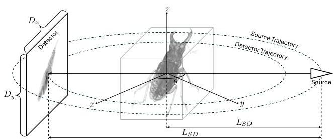

Figure 9: Configuration of a cone-beam CT scanner.

## B Details of dataset

Synthetic data We evaluate methods with various modalities, covering major CT applications such as medical diagnosis, biological research, and industrial inspection. The synthetic dataset consists of 15 cases across three categories: human organs (chest, foot, head, jaw, and pancreas), animals and plants (beetle, bonsai, broccoli, kingsnake, and pepper), and artificial objects (backpack, engine, present, teapot, and mount). The chest and pancreas scans are from LIDC-IDRI [4] and Pancreas-CT [47], respectively. Broccoli and pepper are obtained from X-Plant [58], and the rest are from SciVis [26]. Following [67, 6], we preprocess raw data by normalizing densities to $[0,1]$ and resizing volumes to $256 \times 256 \times 256$. We then use the tomography toolbox TIGRE [5] to capture $512 \times 512$ projections in the range of $0^{\circ} \sim 360^{\circ}$. We add two types of noise: Gaussian (mean 0 , standard deviation 10) as electronic noise of the detector and Poisson (lambda 1e5) as photon scattering noise. All volumes and their projection examples are shown in Fig. 10.

Real-world data We use FIPS [56], a public dataset providing real 2D X-ray projections. FIPS includes three objects (pine [41], seashell [21], and walnut [42]). Each case has 721 projections in the range of $0^{\circ}-360^{\circ}$. We preprocess 2D projections by resizing them to $560 x 560$ and normalizing them to $[0,1]$. Since ground truth volumes are unavailable, we use FDK to create pseudo-ground truth with all views and then subsample 75/50/25 views for sparse-view experiments. The size of the target volume is $256 \times 256 \times 256$.

---

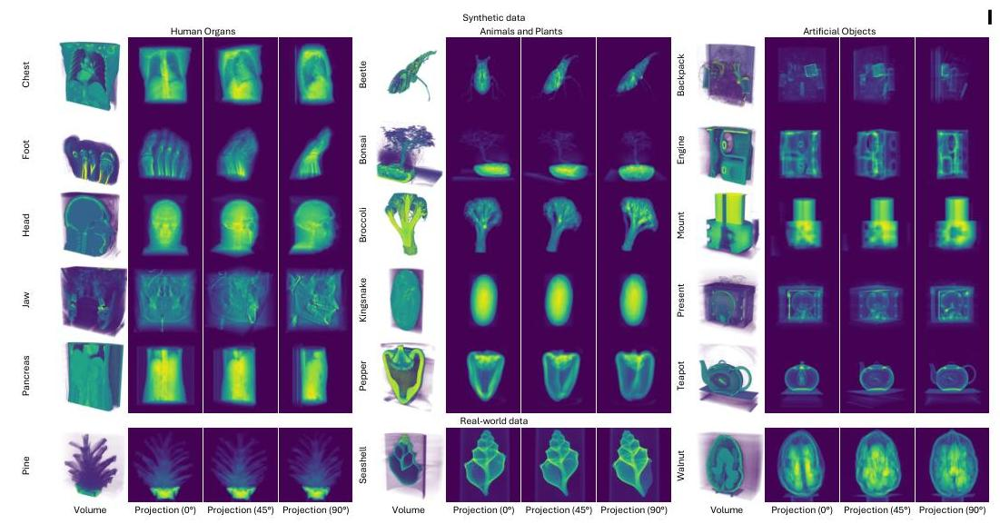

Figure 10: Datasets used for experiments. We show half volume and projection examples for each case.

# C Implementation details of baseline methods 

For fairness, we do not compare methods that require external training data but focus on those that solely use 2D projections of arbitrary objects. We run traditional algorithms FDK, SART, and ASDPOCS with GPU-accelerated tomographic toolbox TIGRE [5], and select three SOTA NeRF-based tomography methods. IntraTomo models the density field with a large MLP. NAF accelerates the training process by hash encoding. SAX-NeRF achieves plausible results with a line segment-based transformer. We use the official code of NAF and SAX-NeRF and conduct experiments with default hyperparameters. The IntraTomo implementation is sourced from the NAF repository. The training iterations of NeRF-based methods are set to 150k (default of NAF and SAX-NeRF). All methods are run on a single RTX 3090 GPU.

## D More qualitative results

Main results We visualize more reconstruction results in Fig. 11 and Fig. 12. FDK and SART introduce notable streak artifacts, while ASD-POCS and IntraTomo blur structural details. NeRF-based solutions perform better than traditional methods but exhibit salt-and-pepper noise. In comparison, our method successfully recovers sharp details and maintains smoothness in homogeneous areas.

Integration bias We show more qualitative comparisons of X-3DGS and ours in Fig. 13. Our method outperforms X-3DGS in both 2D rendering and 3D reconstruction.

Components and parameters We visually compare different components and parameters in Fig. 14. Our newly introduced components improve the reconstruction quality. Our parameter setting also yields the best performance.

Convergence analysis We show the PSNR and SSIM plots in Fig. 15. Our method converges significantly faster than NeRF-based methods and outperforms them in only 3000 iterations.

## E More discussion of limitation

Varying time We present the training times for all cases in Fig. 16. The training time varies across cases, primarily due to the different numbers of kernels used. Our method takes more time on objects

---

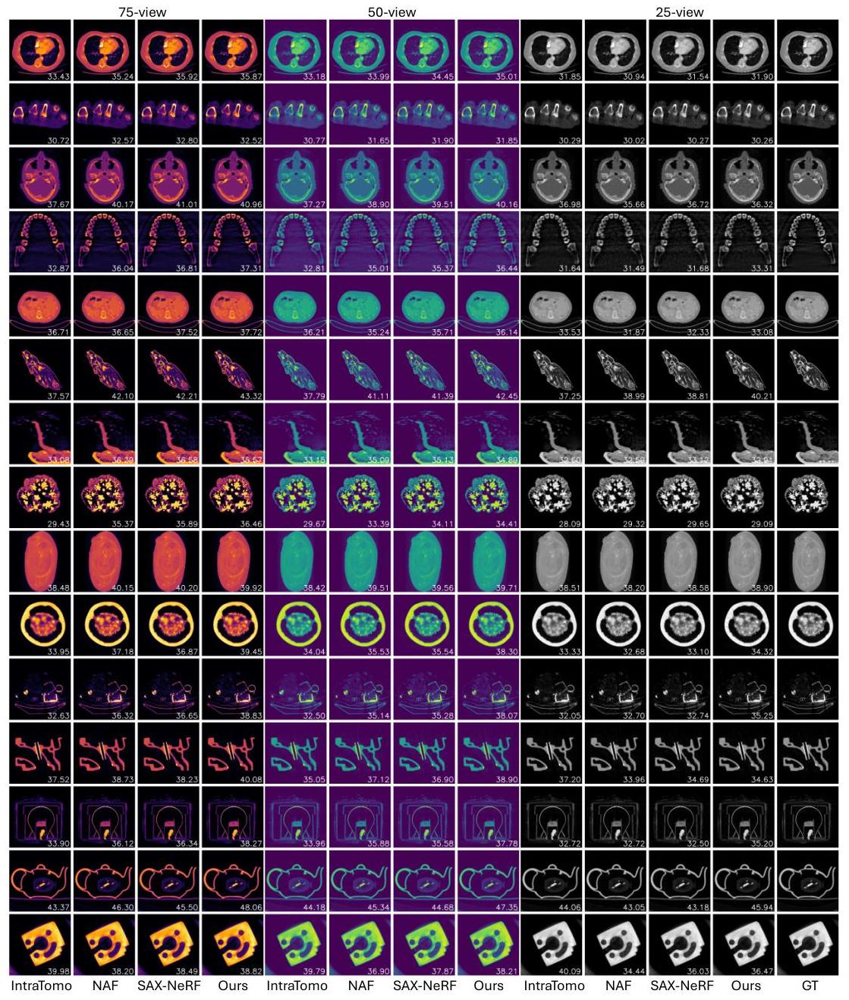

Figure 11: Reconstruction results of NeRF-based methods and our method on the synthetic dataset.
with large homogeneous areas, such as the chest, pancreas, and mount, and less time on those with sparse structures, such as the beetle, backpack, and present.

Needle-like artifacts While our method achieves the highest reconstruction quality, it introduces needle-like artifacts, especially under the 25 -view condition (Fig. 17). This suggests that some Gaussians may overfit specific X-rays. Similar artifacts are also observed in 3DGS [68].

Extrapolation ability While this paper focuses on sparse-view CT (SVCT), we also test $\mathrm{R}^{2}$ Gaussian on limited-angle CT (LACT), where the scanning range is constrained to less than $180^{\circ}$. Unlike SVCT, which highlights the interpolation ability of methods, LACT challenges their extrapolation ability, i.e., estimating unseen areas outside the scanning range. We generate 100 projections within ranges of $0^{\circ} \sim 150^{\circ}, 0^{\circ} \sim 120^{\circ}$, and $0^{\circ} \sim 90^{\circ}$. The quantitative results in Tab. 4 show that

---

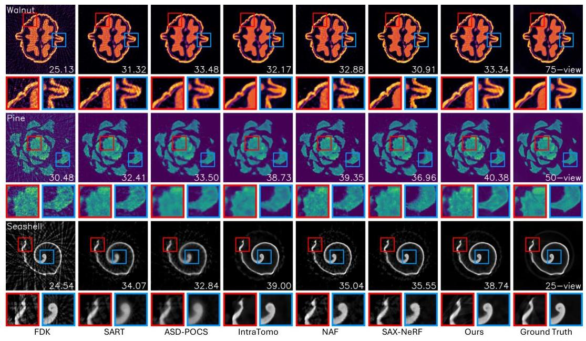

Figure 12: Reconstruction results on the real-world dataset.
our method has slightly lower PSNR but higher SSIM than the NeRF-based method NAF. Visualization results in Fig. 18 indicate that our method recovers more details in scanned areas but exhibits blurred artifacts in unseen areas. We attribute this performance drop to the nature of the networks and kernels. Given the gradient of a ray, NeRF updates the entire network while 3DGS individually optimizes intersected kernels. Thus, NeRF has better global awareness and consistency, while 3DGS is more local-oriented and has suboptimal extrapolation ability.

Calibration error In real-world applications, calibration errors can affect reconstruction quality. For example, tomography requires a reference image $I_{0}$ in Eq. (1) to represent the illumination pattern without the object. This reference image may have artifacts, such as intensity dropoff towards the image boundaries and other non-uniformities in illumination. Additionally, scanner extrinsics and intrinsics may vary during scanning due to heat expansion and mechanical vibrations. Addressing these practical challenges will be the focus of future work.

Anisotropic effects Following existing CT reconstruction methods, we work under the isotropic assumption of X-ray imaging. However, in the real world, some X-ray transport effects, such as Compton scattering, are anisotropic. We do not explicitly model them but treat them as noises on X-ray projections. This is a necessary simplification for CT reconstruction but may induce inaccuracy for novel-view X-ray synthesis. Readers may refer to [7, 14] for using 3DGS for X-ray view synthesis.

Table 4: Quantitative evaluation on limited-angle tomography. We colorize the best, second-best, and third-best numbers.

| Methods | $0^{\circ} \sim 150^{\circ}$ |  |  | $0^{\circ} \sim 120^{\circ}$ |  |  | $0^{\circ} \sim 90^{\circ}$ |  |  |
| :--: | :--: | :--: | :--: | :--: | :--: | :--: | :--: | :--: | :--: |
|  | PSNR $\uparrow$ | SSIM $\uparrow$ | Time $\downarrow$ | PSNR $\uparrow$ | SSIM $\uparrow$ | Time $\downarrow$ | PSNR $\uparrow$ | SSIM $\uparrow$ | Time $\downarrow$ |
| FDK [13] | 26.83 | 0.570 | - | 24.00 | 0.566 | - | 21.22 | 0.547 | - |
| SART [2] | 33.34 | 0.883 | 7m9s | 30.21 | 0.847 | 7m8s | 26.71 | 0.795 | 7m59s |
| ASD-POCS [55] | 33.16 | 0.913 | 3m41s | 29.76 | 0.875 | 3m39s | 26.34 | 0.812 | 4m8s |
| NAF [67] | 36.29 | 0.940 | 27m18s | 33.35 | 0.922 | 27m6s | 29.89 | 0.884 | 27m25s |
| Ours | 36.12 | 0.948 | 9m3s | 32.68 | 0.923 | 8m36s | 29.21 | 0.886 | 8m28s |

---

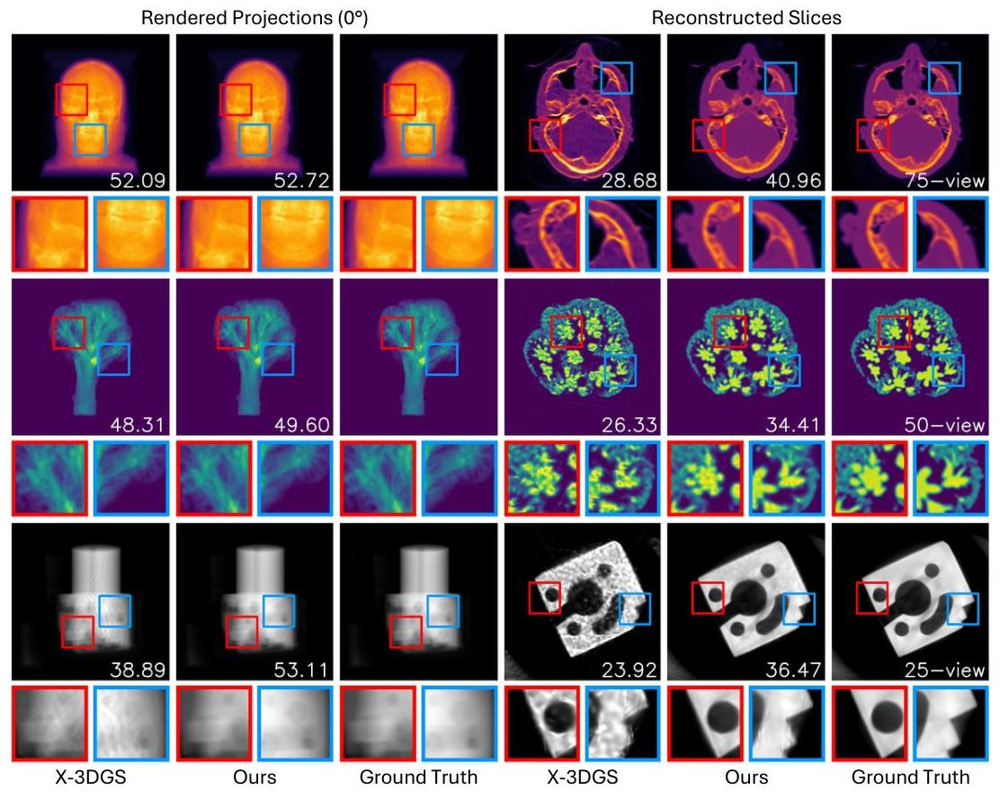

Figure 13: Qualitative comparison of X-3DGS and our method.

# F Broader impacts 

Impacts on real-world applications Computed tomography is an essential imaging technique that is widely used in fields including medicine, biology, industry, etc. Our $\mathrm{R}^{2}$-Gaussian enjoys superior reconstruction performance and fast convergence speed, making it promising to be implemented in real-world applications such as medical diagnosis and industrial inspection.

Impacts on research community We discover a previously unknown integration bias problem in currently popular 3DGS. we speculate that this problem could be universal across all 3DGS-related works. Therefore, our rectification technique may apply to wider practical domains, not limited to tomography but also other tasks such as magnetic resonance imaging (MRI) reconstruction and volumetric-based surface reconstruction.

---

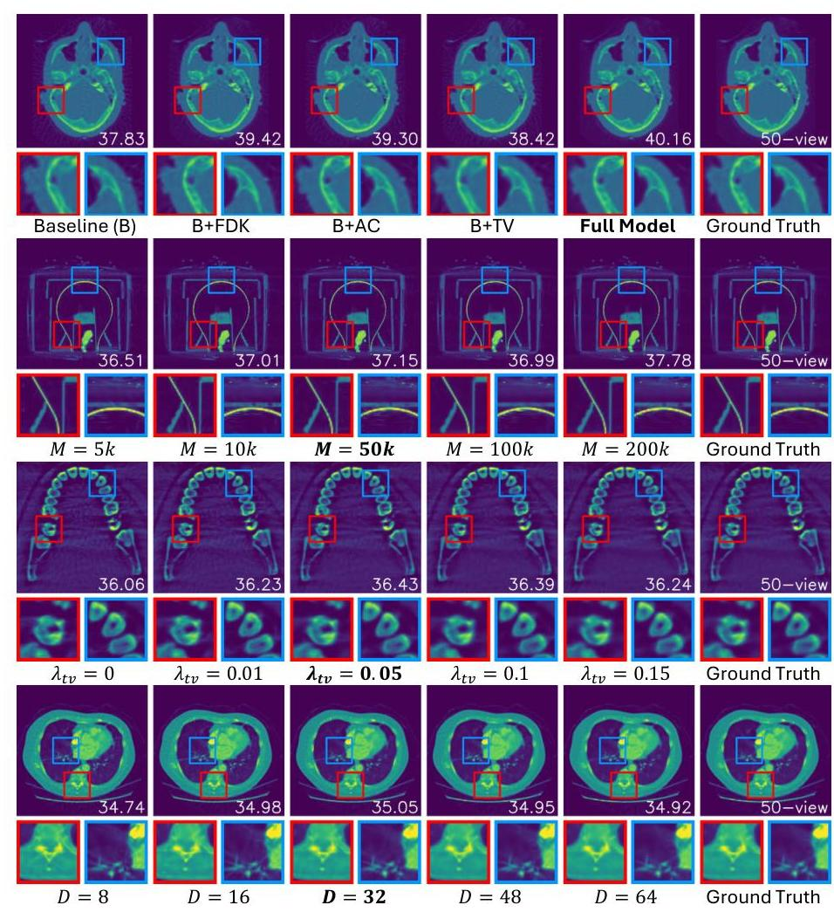

Figure 14: Quantitative comparison of different components and parameters.
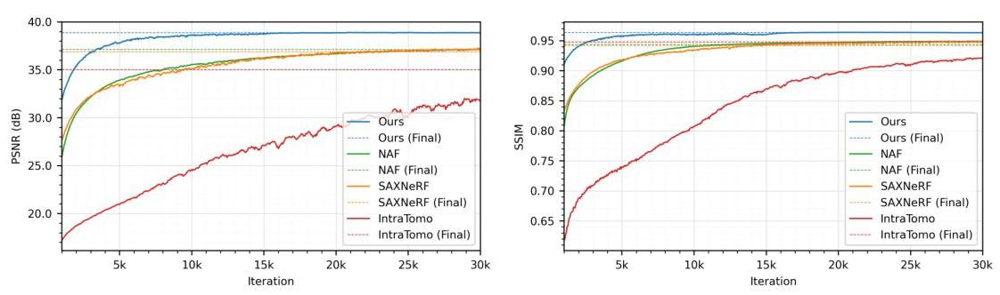

Figure 15: PSNR-iteration and SSIM-iteration plots of case engine, 50-view.

---

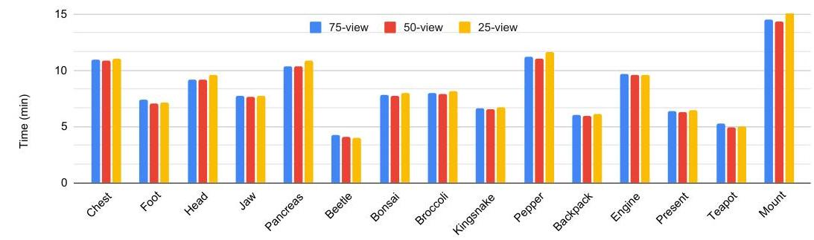

Figure 16: Training time on the synthetic dataset.
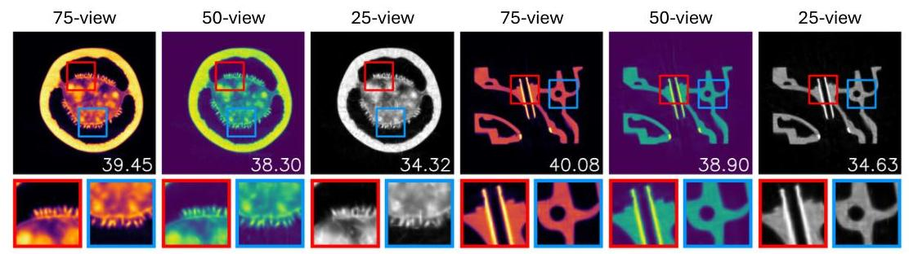

Figure 17: 3DGS-based methods tend to introduce needle-like artifacts when there are insufficient amounts of images. PNSR (dB) is shown at the bottom right of each image.
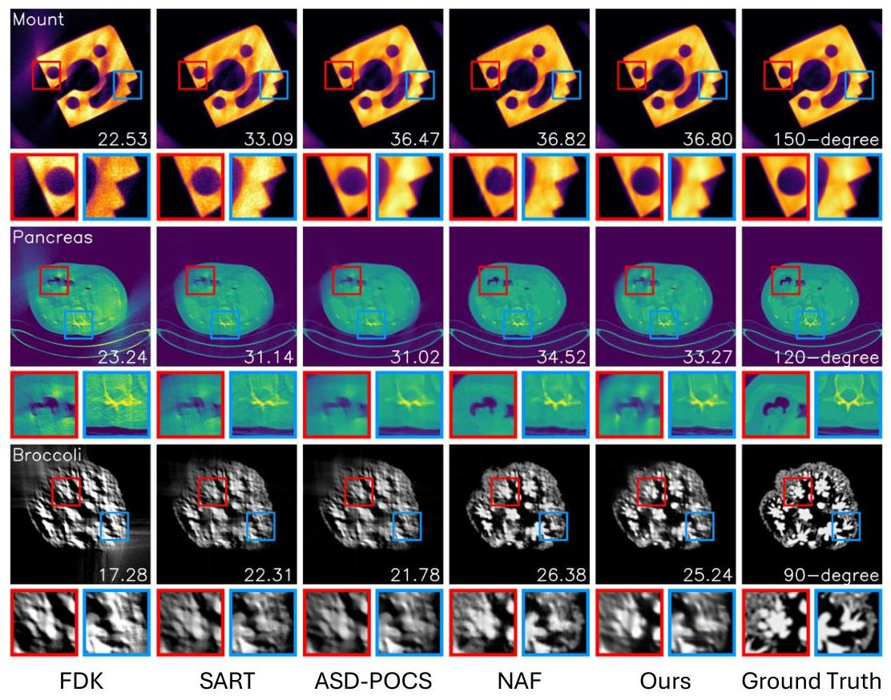

Figure 18: Visualization of reconstruction results under limited-angle scenarios. PNSR (dB) is shown at the bottom right of each image.