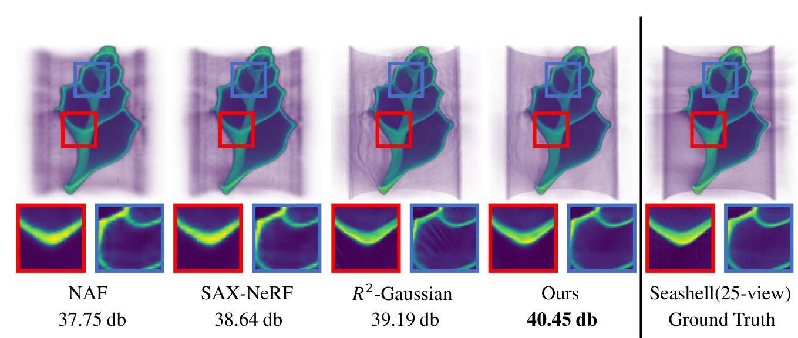
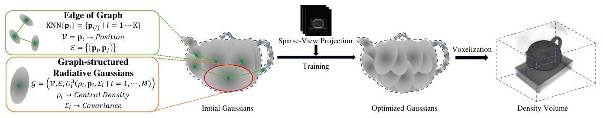
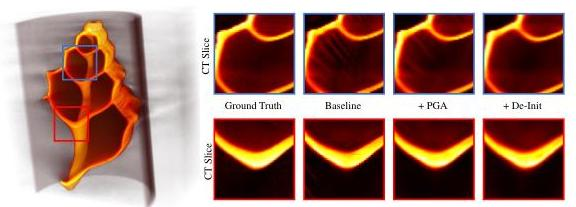
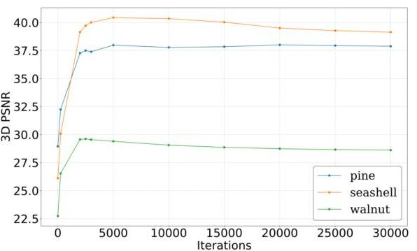

# GR-GAUSSIAN: Graph-Based Radiative Gaussian Splatting for Sparse-View CT Reconstruction 

Yikuang Yuluo ${ }^{1, *}$ Yue Ma ${ }^{2, \dagger}$ Kuan Shen ${ }^{1}$ Tongtong Jin ${ }^{1}$ Yangpu Ma ${ }^{1}$ Wang Liao ${ }^{1}$ Fuquan Wang ${ }^{1, \dagger}$ ${ }^{1}$ Chongqing University ${ }^{2}$ HKUST

Fig 1. Visual results of GR-GAUSSIAN. We compare GR-GAUSSIAN to two NeRF-based methods NAF[44], SAX-NeRF[4]) and $R^{2}$ GS[45] in terms of visual quality and PSNR (dB). Our method mitigates needle-like artifacts and achieves superior CT reconstruction quality under sparse-view conditions.

## Abstract

3D Gaussian Splatting (3DGS) has emerged as a promising approach for CT reconstruction. However, existing methods rely on the average gradient magnitude of points within the view, often leading to severe needle-like artifacts under sparse-view conditions. To address this challenge, we propose GR-Gaussian, a graph-based 3D Gaussian Splatting framework that suppresses needle-like artifacts and improves reconstruction accuracy under sparse-view conditions. Our framework introduces two key innovations: (1) a Denoised Point Cloud Initialization Strategy that reduces initialization errors and accelerates convergence; and (2) a Pixel-Graph-Aware Gradient Strategy that refines gradient computation using graph-based density differences, im-

[^0]proving splitting accuracy and density representation. Experiments on X-3D and real-world datasets validate the effectiveness of GR-Gaussian, achieving PSNR improvements of $\mathbf{0 . 6 7} \mathbf{d B}$ and $\mathbf{0 . 9 2} \mathbf{d B}$, and SSIM gains of $\mathbf{0 . 0 1 1}$ and $\mathbf{0 . 0 2 1}$. These results highlight the applicability of GR-Gaussian for accurate CT reconstruction under challenging sparse-view conditions.

## 1. Introduction

ake the reconstruction problem highly ill-posed. Traditional analytical methods, such as FBP and FDK[8], are computationally efficient but often fail under these conditions, producing artifacts. Model-based optimization approaches[1, 28], which use nonlinear regularizers and iterative solvers (e.g., ART), achieve better results but are computationally expensive.

[^0]:    * Equal contribution.
    $\dagger$ Corresponding Authors.

---

Fig 2. **Training pipeline of GR-Gaussian**. (a) Overall training pipeline. (b) Denoised Point Cloud Initialization Strategy. (c) Pixel-Graph-Aware Gradient Strategy.

Deep learning-based methods[5, 23, 24] demonstrate strong performance but require large labeled datasets and long training times[29, 31]. They also struggle with out-of-distribution objects. NeRF-based[27, 30, 33] approaches show promise in per-case reconstruction but are extremely time-consuming due to extensive point sampling during volume rendering[4, 43, 44]. These methods highlight the trade-off between reconstruction quality and computational efficiency.

Recently, 3D Gaussian Splatting (3DGS)[11, 17, 41] has demonstrated superior quality and efficiency over NeRF in view synthesis tasks[21, 26]. However, when applied to sparse-view tomographic reconstruction, 3DGS-based methods exhibit characteristic needle-like artifacts. Through analysis, we identify that these artifacts arise from the retention of large Gaussian kernels with small gradients during the reconstruction process. This limitation stems from the lack of consideration for inter-point relationships, which results in biased density distributions and insufficient splitting of Gaussian kernels.

To address these issues, we propose a novel framework GR-Gaussian, which introduces graph structures to model relationships between neighboring points. Specifically, we first introduce a **Denoised Point Cloud Initialization Strategy(De-Init)** based on an enhanced FDK method, which reduces noise and artifacts while preserving structural details. Then, we develop a **Pixel-Graph-Aware Gradient Strategy(PGA)** that reconstructs the gradient computation process by incorporating inter-point information. This strategy enables more accurate splitting decisions for Gaussian kernels, effectively mitigating needle-like artifacts and enhancing spatial coherence. Finally, we design an efficient optimization strategy tailored for GR-Gaussian, ensuring robust and accurate reconstruction.

We validate our framework through extensive experiments on both simulated X-3D dataset[45] and Real-world CT datasets [38], comparing it against multiple baseline methods. The results demonstrate that GR-Gaussian outperforms existing approaches in reconstruction quality, achieving PSNR gains of **0.67 dB** and **0.92 dB**, and SSIM improvements of **0.011** and **0.021**. Our main contributions are summarized as follows:

- We propose a novel framework GR-Gaussian, which leverages graph-structured relationships to model objects, providing a solution for sparse-view tomographic reconstruction.
- To address needle-like artifacts in 3DGS-based methods under sparse-view conditions, we introduce the De-Init to

---

enhance the quality of initialization. Then we propose the PGA to improve the gradient computation process.

- Our framework achieves state-of-the-art performance on the X-3D and real-world datasets, demonstrating its effectiveness under challenging sparse-view conditions.

## 2. Related work

### 2.1. Tomographic Reconstruction

Computed Tomography (CT) is a critical imaging technique widely used in medicine $[14,16]$ and industry $[6,42]$. Sparse-view CT reconstruction, where the number of projections is limited, poses significant challenges for traditional methods. Traditional analytical methods, such as Filtered Back Projection (FBP) and its 3D counterpart FDK [8], are computationally efficient but prone to severe streak artifacts in sparse-view scenarios, leading to degraded image quality. Iterative methods [1, 32, 36, 37], which optimize reconstruction through regularized energy minimization, can suppress artifacts but are computationally expensive and risk losing fine structural details. Deep learning methods [5, 23, 24] have shown promise in CT reconstruction, particularly in sparse-view scenarios. Supervised approaches leverage large datasets to learn semantic priors for tasks like projection inpainting [2, 10] and volume denoising [5, 18, 24, 25], but struggle with generalization to unseen data. Self-supervised methods, inspired by NeRF [33], optimize density fields using photometric losses [4, 43, 44] but are computationally prohibitive due to extensive point sampling during rendering.

### 2.2. 3D Gaussian Splatting

3D Gaussian Splatting has demonstrated remarkable performance in RGB tasks, such as surface reconstruction [13, 19, 22], dynamic scene modeling [15, 40, 46], human avatar creation [20, 35], and 3D generation, outperforming NeRF in terms of speed by leveraging highly parallelized rasterization for image rendering. Recent studies have attempted to extend 3DGS to X-ray imaging. For example, Cai [3] empirically modified 3DGS to synthesize novel-view Xray projections, primarily using it as a data augmentation tool for traditional algorithms rather than directly generating CT models. Zha [45] represented the density field with customized Gaussian kernels, yet they replaced the efficient rasterization with existing CT simulators. While effective in certain cases, their approach overfits sparse-view projections, leading to reconstruction failures.

## 3. Method

In this section, we present GR-Gaussian, a novel framework that represents objects through graph-structured relationships (Sec. 3.2). Specifically optimized for sparseview CT reconstruction, our framework effectively tack-
les critical issues, most notably the emergence of needlelike artifacts (Sec. 3.3). We first introduce a Denoised Point Cloud Initialization Strategy based on an enhanced FDK method. Subsequently, a Pixel-Graph-Aware Gradient Strategy is proposed to refine the gradient computation process. Finally, we detail an optimization strategy specifically tailored for GR-Gaussian.

### 3.1. Preliminaries

### 3.1.1 Radiative Gaussians

To represent the target object, previous approach [45] utilize a set of learnable 3D Gaussian kernels, denoted as $\mathbb{G}^{3}=\left\{G_{i}^{3}\right\}_{i=1, \cdots, M}$, which we refer to as Radiative Gaussians. Each kernel $G_{i}^{3}$ defines a local Gaussian-shaped density field, expressed as:

$$
G_{i}^{3}\left(\mathbf{x} \mid \rho_{i}, \mathbf{p}_{i}, \Sigma_{i}\right)=\rho_{i} \cdot e^{\left(-\frac{1}{2}\left(\mathbf{x}-\mathbf{p}_{i}\right)^{T} \Sigma_{i}^{-1}\left(\mathbf{x}-\mathbf{p}_{i}\right)\right)}
$$

Here, $\rho_{i}$ represents the central density, $\mathbf{p}_{i} \in \mathbb{R}^{3}$ denotes the position, and $\Sigma_{i} \in \mathbb{R}^{3 \times 3}$ is the covariance matrix, all of which are learnable parameters. For optimization, $\Sigma_{i}$ is decomposed as $\Sigma_{i}=\mathbf{R}_{i} \mathbf{S}_{i} \mathbf{S}_{i}^{\top} \mathbf{R}_{i}^{\top}$, where $\mathbf{R}_{i}$ and $\mathbf{S}_{i}$ are the rotation and scale matrices, respectively. The overall density at a given position $\mathbf{x} \in \mathbb{R}^{3}$ is computed as the sum of the contributions from all kernels:

$$
\sigma(\mathbf{x})=\sum_{i=1}^{M} G_{i}^{3}\left(\mathbf{x} \mid \rho_{i}, \mathbf{p}_{i}, \Sigma_{i}\right)
$$

Notably, this formulation omits view-dependent color since X-ray attenuation depends solely on isotropic density, rendering it ideal for CT reconstruction.

### 3.1.2 Pixel-Aware Gradient

In 3D Gaussian Splatting, the decision to split or clone a Gaussian kernel $G_{i}^{3}$ is based on the average gradient magnitude of its Normalized Device Coordinates (NDC) across multiple viewpoints. For viewpoint $v$, the NDC coordinates are $\mu_{\text {ndc }}^{i, v}=\left(\mu_{\text {ndc }, \mathrm{x}}^{i, v}, \mu_{\text {ndc }, \mathrm{y}}^{i, v}\right)$, and the corresponding loss is $L_{i}$. An Adaptive Density Control (ADC) mechanism adjusts kernel density every 100 iterations. A splitting or cloning operation is triggered if the average gradient magnitude across $N^{i}$ viewpoints exceeds a threshold $\tau_{\text {pos }}$ :

$$
\frac{1}{N^{i}} \sum_{v=1}^{N^{i}}\left\|\frac{\partial L_{v}}{\partial \mu_{\text {ndc }}^{i, v}}\right\|_{2}>\tau_{\text {pos }}
$$

During photometric reconstruction tasks, the gradient flow through color channels drives density field optimization. For a Gaussian kernel $G_{i}^{3}$ at viewpoint $v$, the gradient

---

Fig 3. The scanned object is represented as graph-based radiative Gaussians, optimized using real X-ray projections to retrieve the density volume via voxelization.

contribution is computed as:

$$(\mathbf{g}_i^c)^{v} = \frac{\partial L_v}{\partial \mu_{udc}^{i,v}} = \sum_{pix=1}^{m^i} \sum_{j=1}^3 \frac{\partial L_v}{\partial c_j^pix} \cdot \frac{\partial c_{j}^{pix}}{\partial \alpha_{v,pix}^{i}} \cdot \frac{\partial \alpha_{v,pix}^{i}}{\partial \mu_{udc}^{i,v}}, \tag{4}$$

Here, $\alpha_{v,pix}^{i}$ represents the contribution factor of a pixel to $G_i^3$, $c_j^pix$ is the intensity of the $j$-th color channel, and $m^i$ is the total number of pixels involved. $\alpha_{v,pix}^{i}$ is defined as a function of the Euclidean distance between the Gaussian's center and the pixel center, decaying exponentially with increasing distance.

Within CT reconstruction tasks, where images are grayscale, gradient computation is simplified by removing the summation over color channels. The gradient contribution of a pixel under viewpoint $v$ to Gaussian $G_i^3$ is:

$$(\mathbf{g}_i^{c'})^{v} = \sum_{pix=1}^{m^i} \frac{\partial L_v}{\partial \alpha_{v,pix}^{i}} \cdot \frac{\partial \alpha_{v,pix}^{i}}{\partial \mu_{udc}^{i,v}}. \tag{5}$$

This adaptation focuses on density contributions and ignores color information. The exponential decay of $\alpha_{v,pix}^{i}$ emphasizes the influence of pixels closer to the Gaussian center, enabling precise gradient updates.

### 3.2. Representing Objects with Graph-based Radiative Gaussians

As shown in Figure 3, an object is represented as a learnable 3D Gaussian graph $\mathcal{G}$, defined as:

$$\mathcal{G} = (\mathcal{V}, \mathcal{E}, \{ G_i^3(\rho_i, \mathbf{p}_i, \Sigma_i) \}_{i=1}^M), \tag{6}$$

where $\mathcal{V} = \{\mathbf{p}_i\}_{i=1}^M$ denotes the positions of the Gaussian kernels, $\mathcal{E}$ represents the edges connecting the kernels, and $G_i^3$ is a Gaussian kernel parameterized by density $\rho_i$, position $\mathbf{p}_i \in \mathbb{R}^3$, and covariance $\Sigma_i \in \mathbb{R}^{3 \times 3}$.

The graph structure $\mathcal{G}$ is constructed to capture spatial relationships between Gaussian kernels. The vertices $\mathcal{V}$ represent kernel positions, while the edges $\mathcal{E}$ are determined using the KNN algorithm:

$$\text{KNN}(\mathbf{p}_i) = \{\mathbf{p}_j \mid j \in \text{argmin}_j \, d(\mathbf{p}_i, \mathbf{p}_j), \, j = 1, \dots, K\}, \tag{7}$$

where the Euclidean distance $d(\mathbf{p}_i, \mathbf{p}_j)$ is given by:

$$d(\mathbf{p}_i, \mathbf{p}_j) = \|\mathbf{p}_i - \mathbf{p}_j\|_2. \tag{8}$$

To ensure bidirectional connectivity, the edge set $\mathcal{E}$ is defined as:

$$\mathcal{E} = \{ (\mathbf{p}_i, \mathbf{p}_j) \mid \mathbf{p}_j \in \text{KNN}(\mathbf{p}_i) \text{ and } \mathbf{p}_i \in \text{KNN}(\mathbf{p}_j) \}. \tag{9}$$

Each Gaussian kernel $G_i^3$ defines a local density field by combining its own density with contributions from neighboring kernels:

$$G_i^3(\mathbf{x}) = \rho_i \cdot G(\mathbf{x} \mid \mathbf{p}_i, \Sigma_i) + \sum_{j \in \mathcal{N}(i)} w_{ij} \cdot \rho_j \cdot G(\mathbf{x} \mid \mathbf{p}_j, \Sigma_j), \tag{10}$$

where $G(\mathbf{x} \mid \mathbf{p}, \Sigma)$ is the Gaussian function:

$$G(\mathbf{x} \mid \mathbf{p}, \Sigma) = \exp\left(-\frac{1}{2}(\mathbf{x} - \mathbf{p})^{\top}\Sigma^{-1}(\mathbf{x} - \mathbf{p})\right), \tag{11}$$

The weight $w_{ij}$ is introduced to quantify the influence of neighboring kernels based on their spatial proximity. It is defined as:

$$w_{ij} = \exp\left(-\frac{\|\mathbf{p}_i - \mathbf{p}_j\|^2}{k}\right), \tag{12}$$

where $\|\mathbf{p}_i - \mathbf{p}_j\|^2$ represents the squared Euclidean distance between kernel positions $\mathbf{p}_i$ and $\mathbf{p}_j$, and $k$ is a scaling factor that controls the sensitivity of the weight to distance. The combined density $D(\mathbf{x})$ at a position $\mathbf{x}$ is computed as:

$$D(\mathbf{x}) = \sum_{i=1}^{M} G_i^3(\mathbf{x}). \tag{13}$$

This graph-based representation is specifically designed to model the relationships between neighboring points, enabling the incorporation of inter-point information. By leveraging these relationships, the framework facilitates the optimization of update strategies, improving the accuracy of the reconstruction process.

---

### 3.3 Training Graph-based Radiative Gaussians

Our training pipeline, illustrated in Figure 2, begins with the initialization of Graph-based Radiative Gaussians from a modified FDK volume. A graph is then constructed using the KNN method to capture spatial relationships between Gaussian kernels. Projections are rasterized to compute photometric losses, while tiny density volumes are voxelized for 3D regularization. Finally, a modified Pixel-Graph-Aware Gradient Strategy is applied to densify the Gaussians.

### 3.3.1 Denoised Point Cloud Initialization Strategy

Previous methods utilize FDK to generate low-quality volumes for initialization. However, under sparse-view conditions, FDK reconstructions suffer from significant noise and artifacts, which degrade subsequent processing. To address this, as shown in Figure 2 (b), we propose a Denoised Point Cloud Initialization Strategy leveraging 3DGS characteristics. Gaussian filtering is applied to the FDK-reconstructed point cloud to suppress noise and artifacts while preserving structural details, ensuring high-quality initialization for robust and accurate reconstruction. The Gaussian filtering process is defined as:

$$
f^{\prime}(i)=\frac{1}{Z} \sum_{j \in \mathcal{N}(i)} G\left(j ; \sigma_{d}\right) \cdot f(i+j)
$$

Here, $i$ denotes the coordinates of the current voxel, and $j$ represents the offset within its neighborhood $\mathcal{N}(i)$, defined as $j_{k} \in[-r, r]$ for all dimensions $k$. The Gaussian kernel is given by:

$$
G\left(j ; \sigma_{d}\right)=\exp \left(-\frac{|j|^{2}}{2 \sigma_{d}^{2}}\right)
$$

where $|j|^{2}=j_{1}^{2}+j_{2}^{2}+\cdots+j_{n}^{2}$, and $Z=\sum_{j \in \mathcal{N}(i)} G\left(j ; \sigma_{d}\right)$ is the normalization factor ensuring the kernel weights sum to 1 . Empty regions are excluded using a density threshold $\tau$, and $M$ points are randomly sampled as kernel positions. Following [45], Gaussian scales are set based on nearest neighbor distances, assuming no rotation. Central densities are directly queried from the denoised volume.

### 3.3.2 Pixel-Graph-Aware Gradient Strategy

Previous methods compute gradients based solely on average values, limiting the contribution of large kernels with small gradients to the densification process. To address this limitation, we propose a Pixel-Graph-Aware Gradient Strategy that integrates graph-based relationships to refine gradient computation and enhance the splitting process. This strategy leverages the density differences between Gaussian kernels and their neighbors, consistent with the characteristics of X-ray CT imaging, where similar tissues or materials exhibit approximately constant attenuation coefficients.

The density difference between a Gaussian kernel $i$ and its neighbors $\mathcal{N}(i)$ is defined as:

$$
\Delta \rho_{i j}=\left|\rho_{i}-\rho_{j}\right|, \quad \forall j \in \mathcal{N}(i)
$$

The density difference $\Delta \rho_{i j}$ between a Gaussian kernel $G_{i}^{3}$ and its neighbor $G_{j}^{3}$ reflects significant variations, with larger values contributing to higher gradient magnitudes. To enhance gradient computation, we incorporate these density differences into the gradient formula. For a Gaussian kernel $G_{i}^{3}$, the augmented gradient is defined as:

$$
\left(\mathbf{g}_{i}^{c}\right)^{v}=\sum_{p i x=1}^{m_{v}^{i}} \frac{\partial L_{v}}{\partial \alpha_{c, p i x}^{i}} \cdot \frac{\partial \alpha_{c, p i x}^{i}}{\partial \mu_{\mathrm{ndc}}^{i, v}}+\lambda_{g} \cdot \frac{\sum_{j \in \mathcal{N}(i)} \Delta \rho_{i j}}{k}
$$

where $\left(\mathbf{g}_{i}^{c}\right)^{v}$ denotes the augmented gradient under viewpoint $v, \lambda_{g}$ is a regularization parameter controlling the influence of neighboring kernels, and $\mathcal{N}(i)$ represents the set of neighbors connected to $G_{i}^{3}$ in the graph. By leveraging graph-based relationships, the augmented gradient effectively captures density variations:

$$
\left(\mathbf{g}_{i}^{c}\right)^{v} \propto \Delta \rho_{i j}, \quad \forall j \in \mathcal{N}(i)
$$

This approach enhances gradient estimation for large kernels, enabling more effective splitting. The increased gradient magnitude improves the representation of the underlying density field, governed by the splitting condition $\left\|\left(\mathbf{g}_{i}^{c}\right)^{v}\right\|>\tau_{\text {pos }}$, where $\tau_{\text {pos }}$ is a predefined threshold. The Pixel-Graph-Aware Gradient Strategy integrates spatial relationships into gradient computation for 3D Gaussian Splatting, leveraging graph-based density differences to refine the splitting strategy.

Fig 4. The Pixel-Graph-Aware Gradient Strategy leverages density differences between Gaussian kernels by constructing a graph to encode point-to-point relationships, enhancing gradient computation and enabling effective splitting of large kernels with low gradients.

---

# 3.3.3 Density Voxelizer 

We employ a voxelizer, denoted as $\mathbf{V}$, to efficiently extract a density volume $V \in R^{X \times V \times Z}$ from the graph-based radiative representation, defined as $V=\mathbf{V}(\mathcal{G})$. The voxelizer [45] divides the target space into $8 \times 8 \times 8$ 3D tiles and performs Gaussian culling to retain kernels with a 99\% confidence of intersecting each tile. Building on this, we incorporate graph-based relationships into the voxelization process. The final voxel values are computed in parallel, as detailed in Eq. 13.

### 3.3.4 Optimization

To optimize the radiative Gaussians, we employ stochastic gradient descent. The total loss function consists of the photometric loss $\mathcal{L}_{1}$, the D-SSIM loss $\mathcal{L}_{\text {ssim }}$ [39], the 3D total variation (TV) regularization $\mathcal{L}_{t v}$, and the graph Laplacian regularization $\mathcal{L}_{\text {lap }}$. The graph Laplacian regularization term $\mathcal{L}_{\text {lap }}$ is defined as:

$$
\mathcal{L}_{l a p}(\mathcal{G})=\sum_{i=1}^{M} \sum_{j \in \mathcal{N}(i)} w_{i j}\left(\rho_{i}-\rho_{j}\right)^{2}
$$

where $\mathcal{G}$ represents the graph structure of the Gaussian kernels, $\rho_{i}$ and $\rho_{j}$ denote the densities of Gaussian kernels $G_{i}^{3}$ and $G_{j}^{3}$, and $w_{i j}$ is the weight of the edge $(i, j)$. This term encourages local smoothness by minimizing density differences between neighboring kernels while preserving boundary information. To further enhance regularization, we define $\mathcal{L}_{\text {norm }}$ as:

$$
\mathcal{L}_{\text {norm }}=\lambda_{l a p} \mathcal{L}_{l a p}(\mathcal{G})+\lambda_{t v} \mathcal{L}_{t v}\left(\mathcal{V}_{t v}\right)
$$

where $\mathcal{L}_{t v}$ represents the 3D total variation regularization applied to the volume $\mathcal{V}_{t v}$. The total loss function is then expressed as:

$$
\mathcal{L}_{\text {total }}=\mathcal{L}_{1}\left(\mathbf{I}_{r}, \mathbf{I}_{m}\right)+\lambda_{s s i m} \mathcal{L}_{s s i m}\left(\mathbf{I}_{r}, \mathbf{I}_{m}\right)+\mathcal{L}_{\text {norm }}
$$

Here, $\mathbf{I}_{r}$ and $\mathbf{I}_{m}$ denote the reconstructed and measured images, respectively.

## 4. Experiments

### 4.1. Experimental Settings

### 4.1.1 Dataset

Following $R^{2}$-Gaussian , we utilize the publicly available X-3D dataset to evaluate our method. This dataset[45] encompasses diverse categories, including human organs(chest, foot, head, jaw, and pancreas), artificial objects(backpack, engine, mount, present, and teapot), and biological specimens(beetle, bonsai, broccoli, kingsnake, and
pepper), providing a comprehensive benchmark for reconstruction performance. Using the tomography toolbox TIGRE, we generate $512 \times 512$ projections along a full circular trajectory, incorporating electric noise and ponton scatter to simulate realistic conditions. Subsequently, CT volumes are scanned within an angular range of $0^{\circ}$ to $360^{\circ}$ to produce 25 -view projections. For the Real-World datasets[38], the projections are directly acquired using CT scanners and correspond to specific angles. Each projection has a resolution of $560 \times 560$. To achieve sparse-view conditions, we uniformly select 25 projection angles from the full angular range of $0^{\circ}$ to $360^{\circ}$. This dataset including pine, seashell and walnut.

### 4.1.2 Implementation Details

The GR-Gaussian framework is implemented using PyTorch[34], PyTorch Geometric[9], and CUDA[12], and optimized with the Adam optimizer[7]. Initial learning rates for location, density, scale, and rotation are set to 0.0002 , $0.01,0.005$, and 0.001 , respectively, with exponential decay reducing them to $10 \%$ of their initial values. Regularization parameters include a television volume level of $D=32$, loss weights $\lambda_{\text {ssim }}=0.25$ and $\lambda_{\mathrm{tv}}=0.05$, a Graph Laplacian weight $\mathcal{L}_{\text {lap }}=8 \times 10^{-4}$, a Gaussian denoising parameter $\sigma_{d}=3$, and a gradient computation weight $\lambda_{\mathrm{g}}=1 \times 10^{-4}$. The framework uses $M=50,000$ Gaussians, a density threshold $\tau=0.001$, and $k=6$ nearest neighbors. A dynamic stopping criterion (Iter stop) evaluates PSNR every 500 iterations, terminating if PSNR decreases by more than $0.5 \%$. All experiments were conducted on an RTX 4090 GPU. Quantitative evaluation employed PSNR and SSIM[39], with PSNR assessing 3D reconstruction accuracy and SSIM evaluating structural consistency across 2D slices.

### 4.2. Results and Evaluation

The experiments aim to evaluate the performance of GRGaussian in sparse-view tomographic reconstruction, focusing on reconstruction quality across X-3D and Realworld datasets. On the X-3D dataset, GR-Gaussian outperforms the SOTA 3DGS-based method [45], NeRF-based methods [4, 44] and three traditional methods [1, 8, 37] in both PSNR and SSIM. As show in Table 1, it achieves a PSNR increase of $\mathbf{0 . 6 7} \mathbf{~ d B}$ and an SSIM improvement of $\mathbf{0 . 0 1 1}$, demonstrating its ability to suppress artifacts and enhance structural consistency. In the experiments with realworld datasets, GR-Gaussian demonstrates significant robustness against noise and artifacts, achieving a PSNR improvement of $\mathbf{0 . 9 2} \mathbf{~ d B}$ and an SSIM improvement of $\mathbf{0 . 0 2 1}$. These results highlight the method's adaptability to practical scenarios, where data imperfections pose significant challenges to reconstruction quality. As shown in Figure

---

| Method | HO | | BS | | AO | | Average | | RD | |
| | PSNR | SSIM | PSNR | SSIM | PSNR | SSIM | PSNR | SSIM | PSNR | SSIM |
| --- | --- | --- | --- | --- | --- | --- | --- | --- | --- | --- |
| FDK | 22.64 | 0.319 | 23.45 | 0.296 | 22.95 | 0.336 | 23.01 | 0.317 | 23.30 | 0.335 |
| SART | 29.58 | 0.773 | 32.37 | 0.878 | 31.48 | 0.825 | 31.14 | 0.825 | 31.52 | 0.790 |
| ASD-POCS | 29.42 | 0.810 | 31.40 | 0.887 | 30.58 | 0.845 | 30.47 | 0.847 | 31.32 | 0.810 |
| NAF | 32.05 | 0.841 | 34.36 | 0.930 | 35.34 | 0.909 | 33.92 | 0.893 | 32.92 | 0.772 |
| SAX-NeRF | 32.53 | 0.858 | 34.67 | 0.940 | 35.85 | 0.917 | 34.35 | 0.905 | 33.49 | 0.793 |
| $R^{2}$-GS | 32.98 | 0.881 | 35.08 | 0.944 | 37.52 | 0.945 | 35.19 | 0.922 | 35.03 | 0.837 |
| Ours | 33.47 | 0.891 | 35.56 | 0.952 | 38.55 | 0.955 | 35.86 | 0.933 | 35.95 | 0.858 |

Table 1. Detailed quantitative results under 25-view. Comparison of our GR-Gaussian with different methods on the X-3D dataset and Real-world dataset. HO: Human Organs, BS: Biological Specimens, AO: Artificial Objects (all from the X-3D dataset); RD: Real-world Dataset.

Fig 5. The left shows CT reconstructions from the X-3D dataset, covering three categories: chest, bonsai, and teapot. The right displays Real-world dataset reconstructions with colorized slices to highlight details, all under 25-view conditions.

| Baseline | De-Init | PGA | X-3D |  | Real-world |  |
| :--: | :--: | :--: | :--: | :--: | :--: | :--: |
|  |  |  | PSNR | SSIM | PSNR | SSIM |
| $\checkmark$ |  |  | 35.20 | 0.923 | 35.28 | 0.836 |
| $\checkmark$ | $\checkmark$ |  | 35.61 | 0.931 | 35.90 | 0.857 |
| $\checkmark$ |  | $\checkmark$ | 35.77 | 0.932 | 35.62 | 0.848 |
| $\checkmark$ | $\checkmark$ | $\checkmark$ | 35.86 | 0.932 | 35.95 | 0.858 |

Table 2. Ablation study of the components of the GR-Gaussian on the X-3D dataset and Real-world dataset.

5, GR-Gaussian produces visually superior reconstructions with sharper edges and fewer streak artifacts compared to other methods. These qualitative improvements align with the quantitative results, further validating the effectiveness of the proposed framework.

### 4.3. Ablation Study

### 4.3.1 Component Analysis

We performed ablation experiments to assess the contributions of Denoised Point Cloud Initialization (De-Init) and Pixel-Graph-Aware Gradient Strategy (PGA) to reconstruction performance on both the simulated X-3D dataset and

Fig 6. Ablation study results highlight the impact of PGA and De-Init in enhancing reconstruction quality.
the real-world dataset. For the ablation study, the baseline model omits the De-Init and PGA components, with Gaussians initialized via an FDK-based approach. To validate the component's efficiency, we measure PSNR and SSIM under 25 views, with results listed in Table 2. Additionally, Figure 6 presents colorized volume and slice examples to visually highlight detailed improvements. Across the Realworld datasets, De-Init effectively mitigates needle-like artifacts, while PGA exhibits superior performance in preserving smooth regions.

---

Table 3. Quantitative results for different k-nearest neighbors and $\sigma_{d}$. Analysis of the X-3D dataset and Real-world dataset.

| Metric | $\mathbf{k = 4}$ | $\mathbf{k = 5}$ | $\mathbf{k = 6}$ | $\mathbf{k = 7}$ | $\mathbf{k = 8}$ |
| --- | --- | --- | --- | --- | --- |
| X-3D Dataset |  |  |  |  |  |
| PSNR | 35.80 | 35.84 | 35.86 | 35.87 | 35.89 |
| SSIM | 0.932 | 0.932 | 0.933 | 0.933 | 0.934 |
| Time | 536s | 567s | 629s | 763s | 865s |
| Real World Dataset |  |  |  |  |  |
| PSNR | 35.82 | 35.87 | 35.95 | 35.97 | 36.01 |
| SSIM | 0.851 | 0.854 | 0.858 | 0.858 | 0.860 |
| Time | 562s | 597s | 669s | 794s | 927s |
| $\sigma_{d}$ | $\mathbf{1}$ | $\mathbf{2}$ | $\mathbf{3}$ | $\mathbf{4}$ | $\mathbf{5}$ |
| X-3D Dataset |  |  |  |  |  |
| PSNR | 35.60 | 35.72 | 35.86 | 35.68 | 35.43 |
| SSIM | 0.926 | 0.928 | 0.933 | 0.927 | 0.925 |
| Real World Dataset |  |  |  |  |  |
| PSNR | 35.90 | 35.93 | 35.95 | 35.91 | 35.85 |
| SSIM | 0.857 | 0.858 | 0.858 | 0.857 | 0.856 |

### 4.3.2 Parameter Analysis

The number of neighbors $k$ and the standard deviation $\sigma_{d}$ of the Gaussian kernel are critical hyperparameters in our method, influencing spatial relationship modeling and noise suppression. Sensitivity analysis on the X-3D and realworld datasets (Table 3) shows optimal reconstruction quality at $k=6$ and $\sigma_{d}=3$, achieving the highest PSNR and SSIM. Larger $k$ improves gradient accuracy by capturing richer neighborhoods but increases computational complexity, while smaller $k$ reduces overhead but compromises gradient precision. For De-Init, $\sigma_{d}$ directly affects filtering efficacy: smaller $\sigma_{d}$ preserves local details but inadequately suppresses noise, whereas larger $\sigma_{d}$ smooths noise effectively but risks over-smoothing edges and details.

Table 4. Quantitative results of SSGU extension.

| Method | w/o SSGU | w/ SSGU $\lambda=3$ | w/ SSGU $\lambda=5$ |
| --- | --- | --- | --- |
| SDS | 40.37 s | 14.12 s | 8.62 s |
| DDS | 66.89 s | 22.65 s | 13.90 s |
| CoSD | 344.76 s | 128.97 s | 79.15 s |

### 4.3.3 Iteration Analysis

Under sparse-view conditions, PSNR initially improves with increased iterations but eventually declines (see Fig. 7). This reduction is less pronounced in the simulated X3D dataset, yet it becomes evident in real-world datasets, where noise and artifacts exacerbate reconstruction degradation. To address this issue, we employ a dynamic iteration stopping criterion (Iter stop), where PSNR is evaluated every 500 iterations. If the PSNR decreases by more than $0.5 \%$, the iteration process is terminated. This approach

Fig 7. Iteration Analysis Reconstruction results of GR-Gaussian across different iterations, illustrating the impact of iteration count on PSNR.
ensures that the model avoids overfitting and maintains optimal reconstruction quality.

## 5. Conclusion

This paper introduces GR-Gaussian, a novel framework based on 3D Gaussian Splatting for sparse-view tomographic reconstruction. Our approach employs a Denoised Point Cloud Initialization Strategy that robustly reduces noise while preserving critical structural details. Furthermore, by incorporating a graph-structured representation together with a novel gradient computation mechanism, GR-Gaussian significantly enhances reconstruction quality and effectively mitigates artifacts under challenging sparse-view conditions. Extensive evaluations on X-3D and real-world datasets demonstrate that our method outperforms existing techniques in both artifact suppression and reconstruction accuracy.

## References

[1] Anders H Andersen and Avinash C Kak. Simultaneous algebraic reconstruction technique (sart): a superior implementation of the art algorithm. Ultrasonic imaging, 6(1):81-94, 1984. 1, 3, 6
[2] Rushil Anirudh, Hyojin Kim, Jayaraman J Thiagarajan, K Aditya Mohan, Kyle Champley, and Timo Bremer. Lose the views: Limited angle ct reconstruction via implicit sinogram completion. In Proceedings of the IEEE Conference on Computer Vision and Pattern Recognition, pages 63436352, 2018. 3
[3] Yuanhao Cai, Yixun Liang, Jiahao Wang, Angtian Wang, Yulun Zhang, Xiaokang Yang, Zongwei Zhou, and Alan Yuille. Radiative gaussian splatting for efficient x-ray novel view synthesis. In European Conference on Computer Vision, pages 283-299. Springer, 2024. 3
[4] Yuanhao Cai, Jiahao Wang, Alan Yuille, Zongwei Zhou, and Angtian Wang. Structure-aware sparse-view x-ray 3d reconstruction. In Proceedings of the IEEE/CVF Conference

---

on Computer Vision and Pattern Recognition, pages 1117411183, 2024. 1, 2, 3, 6
[5] Hyungjin Chung, Dohoon Ryu, Michael T Mccann, Marc L Klasky, and Jong Chul Ye. Solving 3d inverse problems using pre-trained 2d diffusion models. ieee. In CVF Conference on Computer Vision and Pattern Recognition, pages 10-12, 2023. 2, 3
[6] Leonardo De Chiffre, Simone Carmignato, J-P Kruth, Robert Schmitt, and Albert Weckenmann. Industrial applications of computed tomography. CIRP annals, 63(2):655-677, 2014. 3
[7] Kingma Diederik. Adam: A method for stochastic optimization. (No Title), 2014. 6
[8] Lee A Feldkamp, Lloyd C Davis, and James W Kress. Practical cone-beam algorithm. Journal of the Optical Society of America A, 1(6):612-619, 1984. 1, 3, 6
[9] Matthias Fey and Jan Eric Lenssen. Fast graph representation learning with pytorch geometric. arXiv preprint arXiv:1903.02428, 2019. 6
[10] Muhammad Usman Ghani and W Clem Karl. Deep learningbased sinogram completion for low-dose ct. In 2018 IEEE 13th Image, Video, and Multidimensional Signal Processing Workshop (IVMSP), pages 1-5. IEEE, 2018. 3
[11] Antoine Guédon and Vincent Lepetit. Sugar: Surfacealigned gaussian splatting for efficient 3d mesh reconstruction and high-quality mesh rendering. In Proceedings of the IEEE/CVF Conference on Computer Vision and Pattern Recognition, pages 5354-5363, 2024. 2
[12] Design Guide. Cuda c programming guide. NVIDIA, July, 29:31, 2013. 6
[13] Xiaolu Hou, Mingcheng Li, Dingkang Yang, Jiawei Chen, Ziyun Qian, Xiao Zhao, Yue Jiang, Jinjie Wei, Qingyao Xu, and Lihua Zhang. Bloomscene: Lightweight structured 3d gaussian splatting for crossmodal scene generation. Proceedings of the AAAI Conference on Artificial Intelligence, 39(4): 3536-3544, 2025. 3
[14] Godfrey N Hounsfield. Computed medical imaging. Science, 210(4465):22-28, 1980. 3
[15] Han Huang, Yulun Wu, Chao Deng, Ge Gao, Ming Gu, and Yu-Shen Liu. Fatesgs: Fast and accurate sparse-view surface reconstruction using gaussian splatting with depth-feature consistency. Proceedings of the AAAI Conference on Artificial Intelligence, 39(4):3644-3652, 2025. 3
[16] Shigehiko Katsuragawa and Kunio Doi. Computer-aided diagnosis in chest radiography. Computerized Medical Imaging and Graphics, 31(4-5):212-223, 2007. 3
[17] Bernhard Kerbl, Georgios Kopanas, Thomas Leimkühler, and George Drettakis. 3d gaussian splatting for real-time radiance field rendering. ACM Trans. Graph., 42(4):139-1, 2023. 2
[18] Suhyeon Lee, Hyungjin Chung, Minyoung Park, Jonghyuk Park, Wi-Sun Ryu, and Jong Chul Ye. Improving 3d imaging with pre-trained perpendicular 2d diffusion models. In Proceedings of the IEEE/CVF International Conference on Computer Vision, pages 10710-10720, 2023. 3
[19] Yihui Li, Chengxin Lv, Hongyu Yang, and Di Huang. Micromacro wavelet-based gaussian splatting for 3d reconstruction
from unconstrained images. Proceedings of the AAAI Conference on Artificial Intelligence, 39:5057-5065, 2025. 3
[20] Zhe Li, Zerong Zheng, Lizhen Wang, and Yebin Liu. Animatable gaussians: Learning pose-dependent gaussian maps for high-fidelity human avatar modeling. In Proceedings of the IEEE/CVF conference on computer vision and pattern recognition, pages 19711-19722, 2024. 3
[21] Zhihao Liang, Qi Zhang, Ying Feng, Ying Shan, and Kui Jia. Gs-ir: 3d gaussian splatting for inverse rendering. In Proceedings of the IEEE/CVF Conference on Computer Vision and Pattern Recognition, pages 21644-21653, 2024. 2
[22] Jiaqi Lin, Zhihao Li, Binxiao Huang, Xiao Tang, Jianzhuang Liu, Shiyong Liu, Xiaofei Wu, Fenglong Song, and Wenming Yang. Decoupling appearance variations with 3d consistent features in gaussian splatting. Proceedings of the AAAI Conference on Artificial Intelligence, 39(5):52365244, 2025. 3
[23] Yiqun Lin, Zhongjin Luo, Wei Zhao, and Xiaomeng Li. Learning deep intensity field for extremely sparse-view cbct reconstruction. In International Conference on Medical Image Computing and Computer-Assisted Intervention, pages 13-23. Springer, 2023. 2, 3
[24] Jiaming Liu, Rushil Anirudh, Jayaraman J Thiagarajan, Stewart He, K Aditya Mohan, Ulugbek S Kamilov, and Hyojin Kim. Dolce: A model-based probabilistic diffusion framework for limited-angle ct reconstruction. In Proceedings of the IEEE/CVF International conference on computer vision, pages 10498-10508, 2023. 2, 3
[25] Zhengchun Liu, Tekin Bicer, Rajkumar Kettimuthu, Doga Gursoy, Francesco De Carlo, and Ian Foster. Tomogan: lowdose synchrotron x-ray tomography with generative adversarial networks: discussion. Journal of the Optical Society of America A, 37:422-434, 2020. 3
[26] Tao Lu, Mulin Yu, Linning Xu, Yuanbo Xiangli, Limin Wang, Dahua Lin, and Bo Dai. Scaffold-gs: Structured 3d gaussians for view-adaptive rendering. In Proceedings of the IEEE/CVF Conference on Computer Vision and Pattern Recognition, pages 20654-20664, 2024. 2
[27] Yue Ma, Yingqing He, Xiaodong Cun, Xintao Wang, Siran Chen, Xiu Li, and Qifeng Chen. Follow your pose: Poseguided text-to-video generation using pose-free videos. In Proceedings of the AAAI Conference on Artificial Intelligence, pages 4117-4125, 2024. 2
[28] Yue Ma, Hongyu Liu, Hongfa Wang, Heng Pan, Yingqing He, Junkun Yuan, Ailing Zeng, Chengfei Cai, Heung-Yeung Shum, Wei Liu, et al. Follow-your-emoji: Fine-controllable and expressive freestyle portrait animation. In SIGGRAPH Asia 2024 Conference Papers, pages 1-12, 2024. 1
[29] Yue Ma, Kunyu Feng, Xinhua Zhang, Hongyu Liu, David Junhao Zhang, Jinbo Xing, Yinhan Zhang, Ayden Yang, Zeyu Wang, and Qifeng Chen. Follow-your-creation: Empowering 4d creation through video inpainting. arXiv preprint arXiv:2506.04590, 2025. 2
[30] Yue Ma, Yingqing He, Hongfa Wang, Andong Wang, Leqi Shen, Chenyang Qi, Jixuan Ying, Chengfei Cai, Zhifeng Li, Heung-Yeung Shum, et al. Follow-your-click: Open-domain regional image animation via motion prompts. In Proceed-

---

ings of the AAAI Conference on Artificial Intelligence, pages 6018-6026, 2025. 2
[31] Yue Ma, Yulong Liu, Qiyuan Zhu, Ayden Yang, Kunyu Feng, Xinhua Zhang, Zhifeng Li, Sirui Han, Chenyang Qi, and Qifeng Chen. Follow-your-motion: Video motion transfer via efficient spatial-temporal decoupled finetuning. arXiv preprint arXiv:2506.05207, 2025. 2
[32] Stephen H Manglos, George M Gagne, Andrzej Krol, F Deaver Thomas, and Rammohan Narayanaswamy. Transmission maximum-likelihood reconstruction with ordered subsets for cone beam ct. Physics in Medicine \& Biology, 40:1225, 1995. 3
[33] Ben Mildenhall, Pratul P Srinivasan, Matthew Tancik, Jonathan T Barron, Ravi Ramamoorthi, and Ren Ng. Nerf: Representing scenes as neural radiance fields for view synthesis. Communications of the ACM, 65(1):99-106, 2021. 2, 3
[34] A Paszke. Pytorch: An imperative style, high-performance deep learning library. arXiv preprint arXiv:1912.01703, 2019. 6
[35] Wentian Qu, Jiahe Li, Jian Cheng, Jian Shi, Chenyu Meng, Cuixia Ma, Hongan Wang, Xiaoming Deng, and Yinda Zhang. Hogsa: Bimanual hand-object interaction understanding with 3d gaussian splatting based data augmentation. Proceedings of the AAAI Conference on Artificial Intelligence, 39(6):6639-6647, 2025. 3
[36] Ken Sauer and Charles Bouman. A local update strategy for iterative reconstruction from projections. IEEE Transactions on Signal Processing, 41(2):534-548, 2002. 3
[37] Emil Y Sidky and Xiaochuan Pan. Image reconstruction in circular cone-beam computed tomography by constrained, total-variation minimization. Physics in Medicine \& Biology, 53:4777, 2008. 3, 6
[38] The Finnish Inverse Problems Society. X-ray tomographic datasets, 2024. 2, 6
[39] Zhou Wang, Alan C Bovik, Hamid R Sheikh, and Eero P Simoncelli. Image quality assessment: from error visibility to structural similarity. IEEE transactions on image processing, 13(4):600-612, 2004. 6
[40] Guanjun Wu, Taoran Yi, Jiemin Fang, Lingxi Xie, Xiaopeng Zhang, Wei Wei, Wenyu Liu, Qi Tian, and Xinggang Wang. 4d gaussian splatting for real-time dynamic scene rendering. In Proceedings of the IEEE/CVF conference on computer vision and pattern recognition, pages 20310-20320, 2024. 3
[41] Zehao Yu, Anpei Chen, Binbin Huang, Torsten Sattler, and Andreas Geiger. Mip-splatting: Alias-free 3d gaussian splatting. In Proceedings of the IEEE/CVF conference on computer vision and pattern recognition, pages 19447-19456, 2024. 2
[42] Guangming Zang, Ramzi Idoughi, Ran Tao, Gilles Lubineau, Peter Wonka, and Wolfgang Heidrich. Warp-and-project tomography for rapidly deforming objects. ACM Transactions on Graphics (TOG), 38:1-13, 2019. 3
[43] Guangming Zang, Ramzi Idoughi, Rui Li, Peter Wonka, and Wolfgang Heidrich. Intratomo: self-supervised learningbased tomography via sinogram synthesis and prediction. In Proceedings of the IEEE/CVF International Conference on Computer Vision, pages 1960-1970, 2021. 2, 3
[44] Ruyi Zha, Yanhao Zhang, and Hongdong Li. Naf: neural attenuation fields for sparse-view cbct reconstruction. In International Conference on Medical Image Computing and Computer-Assisted Intervention, pages 442-452. Springer, 2022. 1, 2, 3, 6
[45] Ruyi Zha, Tao Jun Lin, Yuanhao Cai, Jiwen Cao, Yanhao Zhang, and Hongdong Li. R²-gaussian: Rectifying radiative gaussian splatting for tomographic reconstruction. In Advances in Neural Information Processing Systems (NeurIPS), 2024. 1, 2, 3, 5, 6
[46] Lingting Zhu, Guying Lin, Jinnan Chen, Xinjie Zhang, Zhenchao Jin, Zhao Wang, and Lequan Yu. Large images are gaussians: High-quality large image representation with levels of 2d gaussian splatting. Proceedings of the AAAI Conference on Artificial Intelligence, 39:10977-10985, 2025. 3